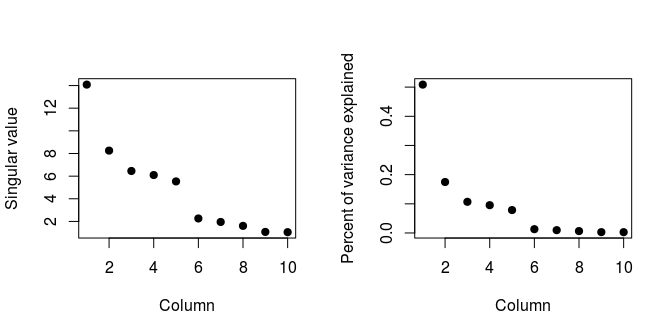

# c4w3 lecture notes
Robert Handsfield  
01/26/2015  


# Hierarchical Clustering ########

Mostly done with the `hclust()` function, clustering organizes into groups things that are close along some dimensions.

Hierarchical clustering is an **agglomerative**, or *bottom up* approach.  You
start with single observations.  You merge obsersvations, and then clusters,
pairwise, as you move up the hierarchy.

The reverse is a **divisive**, or *top down* approach.  You start with one big
cluster, and recursively split off smaller clusters as you travel down the 
hierarchy.

To do agglomerative hierchical clustering, we
1. Find the closest two things
2. Put them together into a cluster
3. Substitute the cluster for the original two things
4. Find the next closest thing
5. Repeat

This approach requires

- A defined 'unit' distance along some dimension
- An approach to the merging

Hierarchical clustering produces a **tree** (dendrogram) showing how close things are to each
other (also known as a distance metric).  A byproduct is a merging schema.

## Distance Metrics

Defining the distance rules is the most important step in hierarchical clustering.
Different types of distances are

- euclidian distance (continuous)
- correlation similarity (continuous)
- manhattan distance (binary)

### Euclidean Distance

The pythagorean distance (shortest line) between two points.

$$
\sqrt{
	\left ( A_1 - A_2 \right )^2 + 
	\left ( B_1 - B_2 \right )^2 +
	. . . +
	\left ( Z_1 - Z_2 \right )^2
}
$$

- simple
- easily extended to high distances
- doesn't scale well to big data sets

### Correlation Similarity

TODO

### Manhattan Distance

Imagine travelling diagonally across city blocks: up, right, up, right, etc.
The Manhattan distance is this distance.  It is the sum of absolute values of
coordinate distances.

$$
|{A_1 - A_2}| +
|{B_1 - B_2}| +
. . . +
|{Z_1 - Z_2}|
$$

- can be more accurate when 'paths' between points are constrained in some way


## Hierarchical Clustering Examples

### Example 1: Creating a Hierarchical Cluster
We need to know the dist() function:
dist(x, method = "euclidean", diag = FALSE, upper = FALSE, p = 2)

The distance method computes a matrix of distances between all rows of the input
matrix.  We can use it to calculate distances between data points.

Plot a set of 12 random points

```r
set.seed(1234);  # initialize random number generator

par(mar = c(5,5,3,2))  # set margins of plot window

# create a set of random points in a 2d space
x <- rnorm(12, mean = rep(1:3, each = 4), sd = 0.2);
y <- rnorm(12, mean = rep(c(1,2,1), each = 4), sd = 0.2);

# pch = 19 : use R pch plotting symbol #19 (blue circle)
# cex = 2  : scale plot symbols to size 2
plot(x,y, col = "blue", pch = 19, cex = 2);

# add a number, 1:12, in order, northeast of every point
text(x + 0.05, y + 0.05, labels = as.character(1:12));
```

 


In the case of our 12R x 2C data frame of points, dist() returns the distance 
matrix for all points in the set (in LT matrix form).

- important parameter: *x, method*

Calculate distances between all point pairs:

```r
df <- data.frame( x = x, y = y);
dist(df);
```

```
##             1          2          3          4          5          6
## 2  0.34120511                                                       
## 3  0.57493739 0.24102750                                            
## 4  0.26381786 0.52578819 0.71861759                                 
## 5  1.69424700 1.35818182 1.11952883 1.80666768                      
## 6  1.65812902 1.31960442 1.08338841 1.78081321 0.08150268           
## 7  1.49823399 1.16620981 0.92568723 1.60131659 0.21110433 0.21666557
## 8  1.99149025 1.69093111 1.45648906 2.02849490 0.61704200 0.69791931
## 9  2.13629539 1.83167669 1.67835968 2.35675598 1.18349654 1.11500116
## 10 2.06419586 1.76999236 1.63109790 2.29239480 1.23847877 1.16550201
## 11 2.14702468 1.85183204 1.71074417 2.37461984 1.28153948 1.21077373
## 12 2.05664233 1.74662555 1.58658782 2.27232243 1.07700974 1.00777231
##             7          8          9         10         11
## 2                                                        
## 3                                                        
## 4                                                        
## 5                                                        
## 6                                                        
## 7                                                        
## 8  0.65062566                                            
## 9  1.28582631 1.76460709                                 
## 10 1.32063059 1.83517785 0.14090406                      
## 11 1.37369662 1.86999431 0.11624471 0.08317570           
## 12 1.17740375 1.66223814 0.10848966 0.19128645 0.20802789
```

In this example, the row/col indices give the point pairs.  Transposing this
output matrix does not change its meaning.

We can now be clever, and find the minimum distance, which gives us the closest 
point pair.  We could then order the pairs by distance, and use that order to 
create a closeness hierarchy.  This is a super-pain to do in R.  

The **hclust()** function does all this automatically, and creates a dendrograph.


```r
hClustering <- hclust( dist( df ) );

plot(hClustering);
```

 

Points (5,6) are closest, (10,11), then (9,12) are next closest.  7 is closest to
(5,6), and 8 is closest to (7,5,6).


How many total clusters are there?  How many clusters are there at a given height?

The total number of cluster units (all clusters + sub-clusters) is the total number of branches, minus the number of points.  

$$
\sum {clusters} = 
\sum {branches} - 
\sum {points}
$$

Dendrograph clusters break into visual groups pretty easily.  In our example, 
the dendrograph has 3 clusters (~ 3 'main' branches?).  This number has something 
to do with relative distance ratios, and the pair distributions around those
critical ratios.

The number of clusters at any height is the number of branches you cross if you
draw a horizontal line at that height.

The number of horizontal 'junctions' in the dendrogram, is always the number of 
cells in the distance matrix diagonal (its length).  

This number of junctions must always be one less than the number of points, unless
some points are equidistant from an additional point, ex: 2 points are 
equidistant from a third.  

In this case, there will be identical values, adjacent to each other, on the 
matrix diagonal.


The *myplclust()* function makes prettier dendrographs.

```r
myplclust( hclust, lab = hclust$labels, lab.col = rep(1, length(hclust$labels)), hang = 0.1, ... )
```

Downloaded from:  https://github.com/DataScienceSpecialization/courses/blob/1125e7d02597aa72ba764ce21ea3618c1ee3cd20/04_ExploratoryAnalysis/clusteringExample/myplclust.R

```r
source("myplclust.R");
myplclust(hClustering, lab = rep(1:3, each = 4), lab.col = rep(1:3, each = 4));
```

 

More pretty plot resources can be found here.

http://gallery.r-enthusiasts.com/RGraphGallery.php?graph=79


### Example 2: Merging Points

Ways to represent merged points:

- Average Linkage: distance between center (point average) of 2 clusters
- Complete Linkage: distance between farthest points of 2 clusters

We usually need to try both methods to see what makes sense.


### Example 3: The heatmap() function

The heatmap() function is good for visualizing large matrices, *if* all the
values are similarly scaled.  It runs cluster analyses on both the rows and 
the columns, which helps visualize blocks of observations.  

```r
df <- data.frame(x = x, y = y);
set.seed(143);

dataMatrix <- as.matrix(df)[sample(1:12), ];

heatmap(dataMatrix);
```

 

Here, there seem to be 3 groups of similar things, with 1 outlier (3).  Close 
groupings of columns suggests correlations between variables.


# K-Means Clustering

K-means clustering is done with the `kmeans()` function and is useful for *summarizing high-dimensional data*.

Like:

* patterns shown by the data
* which observations are similar to each other
* which observations are very different from each other

How well the K-means cluster helps find things that are close together depends on 4 things

1. How we define closeness
2. How we group things
3. How we visualize the grouping
4. How we interpret the grouping

The general method for K-means clustering is

1. Create a number of clusters
2. Get the centers of each cluster
3. Assign data to closest centroid
4  Recalculate the centroids
5. Repeat

The process **requires**

1. A distance metric
2. A fixed number of clusters
3. An initial guess about the location of cluster centroids

The K-means cluster actually produces 2 things:

* A final estimate of the cluster centroids
* An assignment of each point to a cluster

## Defining Closeness
The first choice is the most important for obtaining good results.
The definition requires a *distance metric*, like the Euclidean (continuous), Correlation Similarity(continuous) or Manhattan (binary). The distance metric must make sense for the specific problem.

## K-means Clustering Examples

### Example 1

Plot a set of 12 random points, in roughly 3 clusters

```r
set.seed(1234);  # initialize random number generator

par(mar = c(0,0,0,0))  # set margins of plot window

# create a set of random points in a 2d space
x <- rnorm(12, mean = rep(1:3, each = 4), sd = 0.2);
y <- rnorm(12, mean = rep(c(1,2,1), each = 4), sd = 0.2);

# pch = 19 : use R pch plotting symbol #19 (blue circle)
# cex = 1  : scale plot symbols to size 1
plot(x,y, col = "blue", pch = 19, cex = 1);

# add a number, 1:12, in order, northeast of every point
text(x + 0.05, y + 0.05, labels = as.character(1:12));
```

 

These points do look like they fall into 3 groups. We pass **3** to the `centers` parameter of the function `kmeans()`.

```r
df <- data.frame(x, y);
km <- kmeans(df, centers = 3);

names(km); str(km);
```

```
## [1] "cluster"      "centers"      "totss"        "withinss"    
## [5] "tot.withinss" "betweenss"    "size"         "iter"        
## [9] "ifault"
```

```
## List of 9
##  $ cluster     : int [1:12] 3 3 3 3 1 1 1 1 2 2 ...
##  $ centers     : num [1:3, 1:2] 1.991 2.853 0.89 2.008 0.983 ...
##   ..- attr(*, "dimnames")=List of 2
##   .. ..$ : chr [1:3] "1" "2" "3"
##   .. ..$ : chr [1:2] "x" "y"
##  $ totss       : num 11.2
##  $ withinss    : num [1:3] 0.347 0.033 0.342
##  $ tot.withinss: num 0.722
##  $ betweenss   : num 10.5
##  $ size        : int [1:3] 4 4 4
##  $ iter        : int 2
##  $ ifault      : int 0
##  - attr(*, "class")= chr "kmeans"
```

The `kmeans()` function creates an object with 9 members

1. cluster
	+ integer vector pointing the data points in order to a cluster
2. centers
	+ float array of coordinates for all the centroids
3. totss
	+ the total sum of squares
4. withinss
	+ float vector of sum of squares for each cluster
5. tot.withinss
	+ sum of all withinss values
6. betweenss
	+ "between cluster" sum of squares `totss - tot.withinss`
7. size
	+ integer vector of the number of points in each cluster
8. iter
	+ the number of outer iterations
9. ifault
	+ alert indicator codes for algorithm problems


```r
# plot the points, colored by cluster assignment
plot(x,y, col=km$cluster, pch=19, cex=1)

# draw the cluster centers
points(km$centers, col=1:3, pch=3, cex=2, lwd=2)
```

 

### Example 2 - Heatmaps


```r
set.seed(1234)
dataMatrix <- as.matrix(df)[sample(1:12), ]
kmeansObj2 <- kmeans(dataMatrix, centers = 3)
par(mfrow = c(1, 2), mar = c(2, 4, 0.1, 0.1))
image(t(dataMatrix)[, nrow(dataMatrix):1], yaxt = "n")
image(t(dataMatrix)[, order(km$cluster)], yaxt = "n")
```

 


# Dimension Reduction

Hierarchical clustering is good for finding relationships in data, while dimension reduction is a more formalized method for doing the same. Dimension reduction is used during exploratory analysis and formal modeling phases, and is typically done via 2 techniques.

[Principle Components Analysis](http://en.wikipedia.org/wiki/Principal_component_analysis)
Uses an orthogonal transformation to convert correlated variables into linearly uncorrelated variables - the **principle components**.  Each component is actually an eigenvector of the symmetric covariance matrix, and the variance of each component successively declines.

[Singular Value Decomposition](http://en.wikipedia.org/wiki/Singular_value_decomposition)
Is simply a matrix factorization, similar to the *eigendecomposition*.  The SVD of a matrix $M$ has the form

$$ 
M = U{\Sigma}V^T \cong 
\begin{bmatrix} 
u_{11} & .  & . \\ 
. & . & . \\  
. & .  & u_{mm} 
\end{bmatrix} 
\begin{bmatrix} 
\Sigma_{11} & 0 \\ 
0 & \Sigma_{nn} \\ 
0 & 0 
\end{bmatrix} 
\begin{bmatrix}  
v_{11} & . \\  
. & v_{nn} 
\end{bmatrix}^T 
$$

## Context
For context, consider this random data set that we "dope" with a pattern.

There is no pattern in this data

```r
set.seed(12345)

par(mar = rep(0.2, 4), mfrow = c(1,2))

# a 40r x 10c matrix
dataMatrix <- matrix(rnorm(400), nrow = 40)
```

A hierarchical clustering doesn't show any pattern either

```r
par(mar = rep(0.2, 4))
heatmap(dataMatrix)
```

 

What if we artificially add a pattern to the data?

Add the vector of values `{ 0 0 0 0 0 3 3 3 3 3 }` to 50% of the rows

```r
# new seed
set.seed(678910)

# for each row
for (i in 1:40) {
	
	# flip a coin
	coinFlip <- rbinom(1, size = 1, prob = 0.5)
	
	# if coin is heads: add {0 0 0 0 0 3 3 3 3 3} to that row of values
	if (coinFlip) {
		dataMatrix[i, ] <- dataMatrix[i, ] + rep(c(0, 3), each = 5)
	}
}
```

Now there is a pattern, one quarter of the data (the right half of half the rows) now has a mean of 3 (yellow). The rest retains a mean of 0 (red/orange).

```r
# view the results
par(mar = rep(0.2, 4))

# transpose the matrix and invert the resulting column order
image(1:10, 1:40, t(dataMatrix)[, nrow(dataMatrix):1]); 
```


> 

Looking at the cluster dendrographs, ~25% cluster in orange/red; ~25% cluster in yellow; ~50% still look random

```r
par(mar = rep(0.2, 4))
heatmap(dataMatrix)
```

 

Plotting the row and column means, clearly shows the pattern we have induced

```r
hh <- hclust(dist(dataMatrix))
dataMatrixOrdered <- dataMatrix[hh$order, ]
par(mfrow = c(1, 3))
image(t(dataMatrixOrdered)[, nrow(dataMatrixOrdered):1])
plot(rowMeans(dataMatrixOrdered), 40:1, main="Row Means", xlab = "Row Mean", ylab = "Row", pch = 19)
plot(colMeans(dataMatrixOrdered), main="Col Means", xlab = "Column", ylab = "Column Mean", pch = 19)
```


## Singular Value Decomposition
Takes advantage of the matrix structure of the data (by doing linear algebra & matrix operation thingies).

If we have many variables in a matrix, we can find the smallest set of variables (lower rank matrix) that most completely describes the original data. This transformation compresses the data.

[Singular Value Decomposition](http://en.wikipedia.org/wiki/Singular_value_decomposition)
Is simply a matrix factorization, similar to the *eigendecomposition*.  The SVD of a matrix $M$ has the form

$$ 
M = U{\Sigma}V^T \cong 
\begin{bmatrix} 
u_{11} & .  & . \\ 
. & . & . \\  
. & .  & u_{mm} 
\end{bmatrix} 
\begin{bmatrix} 
\Sigma_{11} & 0 \\ 
0 & \Sigma_{nn} \\ 
0 & 0 
\end{bmatrix} 
\begin{bmatrix}  
v_{11} & . \\  
. & v_{nn} 
\end{bmatrix}^T 
$$

or 

$$ 
X = UDV^T \cong 
\begin{bmatrix} 
u_{11} & .  & . \\ 
. & . & . \\  
. & .  & u_{mm} 
\end{bmatrix} 
\begin{bmatrix} 
d_{11} & 0 \\ 
0 & d_{nn} \\ 
0 & 0 
\end{bmatrix} 
\begin{bmatrix}  
v_{11} & . \\  
. & v_{nn} 
\end{bmatrix}^T 
$$

* columns of $U$ are orthogonal (left singular vectors)
* columns of $V$ are orthogonal (right singular values)
* $D$ is a diagonal matrix (singular values)

### Example 1
The `svd()` function outputs the 3 matrices, $U$, $D$, and $V$ .

```r
# scale the hierarchically clustered data, then perform a single value decomposition
svd1 <- svd(scale(dataMatrixOrdered))
str(svd1)
```

```
## List of 3
##  $ d: num [1:10] 12.46 7.78 6.73 6.3 5.86 ...
##  $ u: num [1:40, 1:10] -0.1411 -0.1389 -0.1533 -0.1288 -0.0891 ...
##  $ v: num [1:10, 1:10] -0.0127 0.1196 0.0334 0.0941 -0.122 ...
```

In the previous section on clustering, plotting the row and column means of the clustered data revealed the shift induced by selectively adding the vector { 0 0 0 0 0 3 3 3 3 3 } (in that example we already knew about the pattern before finding it). We see here that the single value composition also reveals the shift, but automatically, and scaled differently.

```r
par(mfrow = c(1, 3))

image(t(dataMatrixOrdered)[, nrow(dataMatrixOrdered):1])

# matrix U
plot(svd1$u[, 1], 40:1, , xlab = "Row", ylab = "First left singular vector", pch = 19)

# matrix V
plot(svd1$v[, 1], xlab = "Column", ylab = "First right singular vector", pch = 19)
```


The $D$ matrix of the SVD solution, is diagonal, and describes the variance.  Each singular value on the diagonal represents the percent of the variance that is explained by that coefficient. Later, during Principal Component Analysis, these are ordered ordered descending. 

The plots below show **proportion of variance explained**.

```r
par(mfrow = c(1, 2))

# matrix D
plot(svd1$d, main="Raw", xlab = "Column", ylab = "Singular value", pch = 19)

plot(svd1$d^2/sum(svd1$d^2), main="Normalized", xlab = "Column", ylab = "Prop. of variance explained", pch = 19)
```


The first singular value on the right, explains 40% in the total variance of the data (the 0 --> 3 shift).


The singular value decomposition and principal component analysis are related.  The plot below compares the first principal component vector (PCA) to the first right singular vector (SVD).


```r
svd1 <- svd(scale(dataMatrixOrdered))
pca1 <- prcomp(dataMatrixOrdered, scale = TRUE)

plot(pca1$rotation[, 1], svd1$v[, 1], pch = 19, xlab = "Principal Component 1", ylab = "Right Singular Vector 1")
abline(c(0, 1))
```

 

### Example 2
More about the *Variance Explained* 

The plots below show a 40x10 binary matrix.  Each row contains 5 zeroes and 5 ones.

```r
constantMatrix <- dataMatrixOrdered*0

for(i in 1:dim(dataMatrixOrdered)[1]) {
	constantMatrix[i,] <- rep(c(0,1),each=5)
}

svd1 <- svd(constantMatrix)

par(mfrow=c(1,3))

image(t(constantMatrix)[,nrow(constantMatrix):1])
plot(svd1$d, main="Raw", xlab="Column", ylab="Singular value", pch=19)
plot(svd1$d^2/sum(svd1$d^2), main="Normalized", xlab="Column", ylab="Prop. of variance explained", pch=19)
```


100% of the data variance is explained by the first singular value, meaning that only a small part of the matrix is useful, meaning that the matrix can be compressed!

### Example 3
Adding a second, more complex pattern:

To the data from Example 1, a 40x10 random distribution doped by { 0 0 0 0 0  3 3 3 3 3} for 50% of the rows, we add the following:

* 25% of the rows will receive `row + { 0 0 0 0 0  0 0 0 0 0 }`
* 25% of the rows will receive `row + { 0 0 0 0 0  5 5 5 5 5 }`
* 25% of the rows will receive `row + { 0 5 0 5 0  5 0 5 0 5 }`
* 25% of the rows will receive `row + { 0 5 0 5 0  10 5 10 5 10 }`


```r
set.seed(678910)

for (i in 1:40) {
	# flip a coin
	coinFlip1 <- rbinom(1, size = 1, prob = 0.5)
	coinFlip2 <- rbinom(1, size = 1, prob = 0.5)
	
	# if coin is heads add a common pattern to that row
	if (coinFlip1) {
		dataMatrix[i, ] <- dataMatrix[i, ] + rep(c(0, 5), each = 5)
	}
	
	if (coinFlip2) {
		dataMatrix[i, ] <- dataMatrix[i, ] + rep(c(0, 5), times = 5)
	}
}
hh <- hclust(dist(dataMatrix))
dataMatrixOrdered <- dataMatrix[hh$order, ]
```

The result is one pattern of different means between the left and right columns, and a second pattern of different means alternating between columns.  

```r
svd2 <- svd(scale(dataMatrixOrdered))

par(mfrow = c(1, 3))

image(t(dataMatrixOrdered)[, nrow(dataMatrixOrdered):1])
plot(rep(c(0, 1), each = 5), pch = 19, xlab = "Column", ylab = "Pattern 1")
plot(rep(c(0, 1), times =5), pch = 19, xlab = "Column", ylab = "Pattern 2")
```


The SVD should be able to pick out the middle and right patterns from the data on the left.

```r
svd2 <- svd(scale(dataMatrixOrdered))

par(mfrow = c(1, 3))

image(t(dataMatrixOrdered)[, nrow(dataMatrixOrdered):1])
plot(svd2$v[, 1], pch = 19, xlab = "Column", ylab = "First right singular vector")
plot(svd2$v[, 2], pch = 19, xlab = "Column", ylab = "Second right singular vector")
```


In fact, in the middle plot, the first 5 points are lower than the second 5, corresponding to pattern 1.  The points in the right plot follow a "down, up, down, up" pattern, corresponding with pattern 2.  But each of the first 2 singular components will represent most of the data, so both plots show a block **and** alternating pattern.

What about the variance explained?

The first component explains over 50% of the variance, due to the big binary shift of pattern 1. The alternating pattern 2 isn't really visible in the variance ($D$) components, although the plot is more jagged than the plot for data with only pattern 1 (previous example).

```r
svd1 <- svd(scale(dataMatrixOrdered))

par(mfrow = c(1, 2))

plot(svd1$d, xlab = "Column", ylab = "Singular value", pch = 19)
plot(svd1$d^2/sum(svd1$d^2), xlab = "Column", ylab = "Percent of variance explained", pch = 19)
```



### Example 4 - Missing Values
Missing values really screw up matrix decompositions.


```r
dataMatrix2 <- dataMatrixOrdered

## Randomly insert some missing data
dataMatrix2[sample(1:100, size = 40, replace = FALSE)] <- NA

svd1 <- svd(scale(dataMatrix2)) ## Doesn't work!
```

```
## Error in svd(scale(dataMatrix2)): infinite or missing values in 'x'
```

See!

We can "repair" missing values by *imputing* with the **impute** package from the R biocLite toolkit.

The [`impute.knn()`](http://bioconductor.org/packages/release/bioc/manuals/impute/man/impute.pdf) function averages values from the nearest neighbor rows and replaces an NA with the local average.  (Because standard form is col=var, row=obs).

Important `impute.knn()` parameters
* `data` = a matrix
* `k` = number of neighbor rows to average
* {`rowmax`, `colmax`} = percent of missing data allowed in row / col

Dope a matrix with random `NA`, then impute the `NA` values.

```r
library(impute) ## Available from http://bioconductor.org

dataMatrix2 <- dataMatrixOrdered
dataMatrix2[sample(1:100,size=40,replace=FALSE)] <- NA

# impute.knn(data, k=10, rowmax=0.5, colmax=0.8, maxp=1500, rng.seed=362436069)
dataMatrix2 <- impute.knn(dataMatrix2)$data
```

With the missing values imputed, we can now perform a singular value decomposition and plot the **R**ight **S**ingular **V**alues ($V$ matrix).

```r
svd1 <- svd(scale(dataMatrixOrdered)); 
svd2 <- svd(scale(dataMatrix2))

par(mfrow=c(1,2)); 

plot(svd1$v[,1], main="RSV: Original", pch=19) 
plot(svd2$v[,1], main="RSV: Imputed", pch=19)
```


The imputation doesn't appear to change the singular values much, althouth it does change the plots of the raw data.

```r
par(mfrow=c(1,2)); 

plot(dataMatrixOrdered, main="Plot: Original", pch=19) 
plot(dataMatrix2, main="Plot: Imputed", pch=19)
```


### Example 5 - Compression
Use the singular value decomposition method to develop a lower rank representation of an image.

Load the data

```r
fileUrl <- "https://spark-public.s3.amazonaws.com/dataanalysis/face.rda"
download.file(fileUrl, destfile = "face.rda", method="curl")

load("face.rda")

image(t(faceData)[, nrow(faceData):1])
```

 

Perform an SVD and plot the variance explained ($D$ matrix)

```r
svd1 <- svd(scale(faceData))
plot(svd1$d^2/sum(svd1$d^2), pch = 19, xlab = "Singular vector", ylab = "Variance explained")
```


The first 5singular vectors explain over 96% of the variance (pixel differences).

```r
sum( ( svd1$d^2 / sum(svd1$d^2) )[1:5] )
```

```
## [1] 0.8842596
```

Calculate approximations of the image from the 1^st^, 5^th^, and 10^th^ singular vectors, by performing

$$ 
UDV^T \cong 
\begin{bmatrix} 
u_{11} & .  \\ 
. & u_{mn} \\  
\end{bmatrix} 
\begin{bmatrix} 
d_{11} & 0 \\ 
0 & d_{nn} \\ 
\end{bmatrix} 
\begin{bmatrix}  
v_{11} & . \\  
. & v_{kn} 
\end{bmatrix}^T 
= X
$$

1. find the matrix product of the first $n$ columns of $U$ and the $n$x$n$ subset of $D$
	+ $\begin{bmatrix} u_{11} & .  \\ . & u_{mn} \\ \end{bmatrix} \times 
		\begin{bmatrix} d_{11} & 0 \\ 0 & d_{nn} \\ \end{bmatrix} $
2. find the matrix product of (1) and the transpose of the first $n$ columns of $V$
	+ $\begin{bmatrix} (1)_{11} & . \\ . & (1)_{mn} \\ \end{bmatrix} \times
		\begin{bmatrix} v_{11} & . \\  . & v_{kn} \end{bmatrix}^T$


```r
svd1 <- svd(scale(faceData))

# Note that %*% is matrix multiplication
# Here svd1$d[1] is a constant
approx1 <- svd1$u[, 1] %*% t(svd1$v[, 1]) * svd1$d[1]

# In these examples we need to make the diagonal matrix out of d
approx5 <- svd1$u[, 1:5] %*% diag(svd1$d[1:5]) %*% t(svd1$v[, 1:5])
approx10 <- svd1$u[, 1:10] %*% diag(svd1$d[1:10]) %*% t(svd1$v[, 1:10])
```

Plot the results

```r
par(mfrow = c(1, 4))

image(t(approx1)[, nrow(approx1):1], main = "(a)")
image(t(approx5)[, nrow(approx5):1], main = "(b)")
image(t(approx10)[, nrow(approx10):1], main = "(c)")
image(t(faceData)[, nrow(faceData):1], main = "(d)") ## Original data
```


For singular value decomposition, the absolute, scale independent magnitude of the values matter.  For best results, shift the units so that measurements and ranges have similar magnitudes. 


## Principal Component Analysis
Takes advantage of the matrix structure of the data (by doing linear algebra & matrix operation thingies).

When there are many, many variables correlated with each other, ___ can reduce the set of variables to a smaller set that are all uncorrelated with each other. This is a statistical transformation of the data set.

[Principal Components Analysis](http://en.wikipedia.org/wiki/Principal_component_analysis)
Uses an orthogonal transformation to convert correlated variables into linearly uncorrelated variables - the **principal components**.  Each component is actually an eigenvector of the symmetric covariance matrix, and the variance of each component successively declines.

The PCA uses the SVD.

The algorithm is 

1. subtract the column mean from each column
2. divides each column by the column standard deviation
3. run an SVD on the resulting normalized matrix
4. the principal components are equal to the right singular values (values in the V matrix)


# Plotting with Color
The `colors()` function lists the 657 colors you can use with any plotting function.


## grDevices Functions - colorRamp() and colorRampPaletter()
The `colorRamp()` and `colorRampPalette()` interpolate sets of input colors, and are used to create custom color palettes, color ramps, color mappings, and gradients.


### Example 1 - Custom palette with `colorRamp()`

Use `colorRamp()` to create a 0:1 interpolation function between 2 colors.

```r
pal <- colorRamp( c("red", "blue") );

pal(0); pal (0.5); pal(1);
```

```
##      [,1] [,2] [,3]
## [1,]  255    0    0
```

```
##       [,1] [,2]  [,3]
## [1,] 127.5    0 127.5
```

```
##      [,1] [,2] [,3]
## [1,]    0    0  255
```

Pass a sequence to our custom `pal()` function to create a list of 10 RGB vectors from red to blue.

```r
# pal only takes values in 0:1
pal( seq(from=0, to=1, len=10) );
```

```
##            [,1] [,2]      [,3]
##  [1,] 255.00000    0   0.00000
##  [2,] 226.66667    0  28.33333
##  [3,] 198.33333    0  56.66667
##  [4,] 170.00000    0  85.00000
##  [5,] 141.66667    0 113.33333
##  [6,] 113.33333    0 141.66667
##  [7,]  85.00000    0 170.00000
##  [8,]  56.66667    0 198.33333
##  [9,]  28.33333    0 226.66667
## [10,]   0.00000    0 255.00000
```

### Example 2 - Custom palette with `colorRampPalette()`
Use `colorRampPalette()`

The custom interpolation function created by `colorRampPalette()` takes integers as arguments.  The integers are the number of steps in which to complete the interpolation.

```r
pal <- colorRampPalette( c("red", "blue") );

# interpolate from red to blue in 2 steps (yields boundaries)
pal(2);
```

```
## [1] "#FF0000" "#0000FF"
```

```r
# interpolate from red to blue in 10 steps
pal(10);
```

```
##  [1] "#FF0000" "#E2001C" "#C60038" "#AA0055" "#8D0071" "#71008D" "#5500AA"
##  [8] "#3800C6" "#1C00E2" "#0000FF"
```

Our custom `pal()` function created by `colorRampPalette()` returns lists of hexadecimal color codes.

## RColorBrewer Package	
The RColorBrewer package contains collections of palettes.

There are 3 types of palettes

* Sequential - for ordered data
* Qualitative - for non-ordered data, like factors
* Diverging  - for showing deviations, and diverging data 


The first group lists the Sequential palettes. The second lists the high-contrast Qualitative palettes. The third lists the Diverging palettes.  

```r
#install.packages("RColorBrewer");
library("RColorBrewer");

display.brewer.all();
```


The names of the ordered palettes indicate the direction of light to dark color interpolation: "BuGn" means "Light Blue to Dark Green".

```r
par( mfrow = c(2,1) );
display.brewer.pal(n=9, name="BuGn");
display.brewer.pal(n=9, name="GnBu");
```

 


Load 

```r
# Load colors from the Blue-Green Palette (3 is the minimum value; more colors generally make the end plot darker and bolder).
colors <- brewer.pal(n=3, name="BuGn");
 
colors;
```

```
## [1] "#E5F5F9" "#99D8C9" "#2CA25F"
```

Generate a custom interpolation function from the color selection

```r
pal <- colorRampPalette(colors);

image(volcano, col = pal(20));
```

 

### Example 3 - Smooth Scatter with `RColorBrewer`

The `smoothScatter()` function performs a kernel density estimate, then plots a smoothed color density representation.  By default, it uses the blues color palette.

```r
x <- rnorm(10000);
y <- rnorm(10000);

smoothScatter(x,y)
```

 

Customize the palette for `smoothScatter()` -- doesn't work

```r
# @todo - fix this
pal <- colorRampPalette(c("green", "orange", "red"));

smoothScatter(x, y, nbin=128, bandwidth=10, colramp=pal  );
```

 

```r
#smoothScatter(x, y, colramp = pal(10));
```

## Other functions

`rgb()` Takes 3:4 numeric arguments and returns a hexadecimal color string.  May be used to generate lists of colors.

`colorspace` package should be explored

### Example 4 - Create a list of colors with `rgb()`

```r
r = c(11, 24, 229);
g = c( 0, 238, 15);
b = c(255, 6, 0);
a = c(200, 225, 255);

colors <- data.frame(r,g,b);

hex_colors <- rgb(colors, alpha=a, maxColorValue = 255);

colors;
```

```
##     r   g   b
## 1  11   0 255
## 2  24 238   6
## 3 229  15   0
```

```r
hex_colors;
```

```
## [1] "#0B00FFC8" "#18EE06E1" "#E50F00FF"
```

### Example 5 - Plotting with transparency


```r
x <- rnorm(300);
y <- rnorm(300);

par(mfrow=c(1,2));

plot(x,y, pch=19);
plot(x,y, col=rgb(0,0,0,0.2), pch=19);
```


