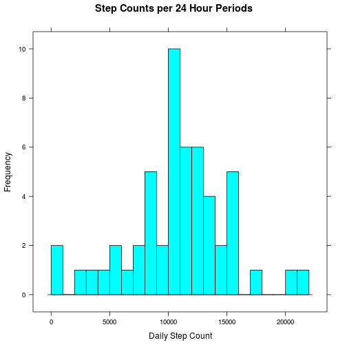
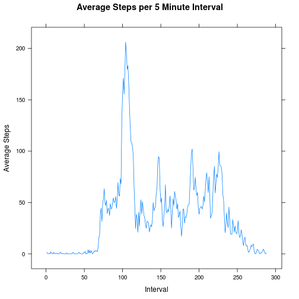
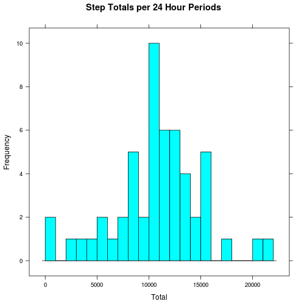
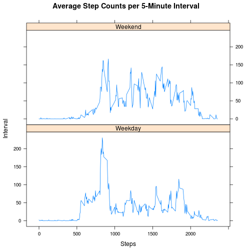

This assignment requires the packages: caTools, dplyr, graphics, grDevices, knitr, lattice, methods,  rmarkdown, stats, utils.

This assignment makes use of data from a personal activity monitoring device. This device collects data at 5 minute intervals through out the day. The data consists of two months of data from an anonymous individual collected during the months of October and November, 2012 and include the number of steps taken in 5 minute intervals each day. The dataset is stored in a comma-separated-value (CSV) file and there are a total of 17,568 observations in this dataset.

Variables: 

- steps: Number of steps taking in a 5-minute interval (missing values are coded as NA)

- date: The date on which the measurement was taken in YYYY-MM-DD format

- interval: Identifier for the 5-minute interval in which measurement was taken


Get the source data
----------------------------------------------
The file is a .zip archive, which needs to be extracted

```r
fileUrl <- "https://d396qusza40orc.cloudfront.net/repdata%2Fdata%2Factivity.zip";
download.file(fileUrl, destfile = "./activity.zip", method = "curl" );
```


Extract "activity.csv"" from "activity.zip", and remove the .zip

```r
df <- read.csv(unz("./activity.zip", "activity.csv"));
write.csv(df, file="./activity.csv", row.names=FALSE);
unlink("./activity.zip");
```
Data is stored in 'df'.


What is the mean total of steps taken per day?
----------------------------------------------
For this part of the assignment, I ignore the missing values in the dataset.  
FYI: *step* is the only variable with NA values.


```r
dff <- df[complete.cases(df),];
```

### 1. Make a histogram of the total number of steps taken each day

Find the total number of steps each day

```r
stepSum <- data.frame(aggregate(dff$steps, by=list(dff$date), FUN=sum));
names(stepSum) <- c("date", "steps");
```


Build the histogram

```r
lattice::histogram(~steps, data=stepSum, type="count", nint=22, 
		   endpoints=c(0,22000), xlab="Daily Step Count", ylab="Frequency",
		   main="Step Counts per 24 Hour Periods");
```

 

### 2. Calculate the mean and median
Calculate and report the **mean** and **median** number of steps taken per day

```r
mean(stepSum$steps); 
```

```
## [1] 10766.19
```

```r
median(stepSum$steps);
```

```
## [1] 10765
```


What is the average daily activity pattern?
----------------------------------------------
### 1. Make a time series plot
Make a time series plot (i.e. type = "l") of the 5-minute interval (x-axis) and 
the average number of steps taken, averaged across all days (y-axis)

Calculate the daily step average of each 5-min interval

```r
dff$interval <- as.factor(dff$interval);
stepAvg <- aggregate(dff$steps, by = list(dff$interval), FUN = mean);
names(stepAvg) <- c("interval", "steps");
```

Build the time series plot

```r
# build the plot
# convert x to numeric to allow axis auto-scaling
lattice::xyplot(steps ~ as.numeric(interval), data=stepAvg, type = 'l',
		xlab="Interval", ylab="Average Steps", 
		main="Average Steps per 5 Minute Interval");
```

 


### 2. Where is the maximum?
Which **5-minute interval**, on average across all the days in the dataset, contains
the maximum number of steps?


```r
maxrow <- which( stepAvg$steps == max(stepAvg$steps));
stepAvg[maxrow,];
```

```
##     interval    steps
## 104      835 206.1698
```

The highest 5-minute average step count occurs during the 104<sup>th</sup> interval,
which corresponds to minutes 835 -- 839.  Or 13 hours, 55 minutes after the first interval of the day.


Imputing missing values
----------------------------------------------

Note that there are a number of days/intervals where there are missing values (coded as NA). The presence of missing days may introduce bias into some calculations or summaries of the data.

### 1. Calculate the number of missing values
Calculate and report the total number of missing values in the dataset (i.e.
the total number of rows with NAs)

Count the number of rows with NAs:

```r
nrowNA <- sum(!complete.cases(df));
nrowNA;
```

```
## [1] 2304
```


### 2. Fill in the missing values
Devise a strategy for filling in all of the missing values in the dataset. The strategy does not need to be sophisticated. For example, you could use the mean/median for that day, or the mean for that 5-minute interval, etc.

Strategy: Replace NAs in the step column with the interval step-average.

1.  Copy the source data frame to a new df
2.  Find the rows with NAs to replace
3.  For those rows
	1. Get the time interval
	2. Find the row corresponding to that interval in the data frame of interval-averaged step counts.
	3. Get the average step count from the row from (2)
	4. Replace the NA with the average step count from (3)


### 3. Create a new dataset
Create a new dataset that is equal to the original dataset but with the missing
data filled in.

Create a data frame to modify:

```r
completeDf <- df;
```

Find the rows to fix (replace NA value):

```r
fixMe <- which(!complete.cases(completeDf));
dfFixMe <- data.frame(fixMe);
names(dfFixMe) <- "rows";
```

Get the time intervals from the faulty rows:

```r
intervalToMatch <- completeDf[fixMe, "interval"];
```

Replace NAs with time interval step averages:

```r
for (i in 1:length(fixMe)) {
	# get the df row to modify
	theRow <- fixMe[i];
	
	# get the time interval of the current row
	itm <- intervalToMatch[i]; 
	
	# get the interval average steps from the stepAvg df
	theAvg <- stepAvg[which(stepAvg$interval == itm),"steps"];
	
	# insert the step average into the current df row
	completeDf$steps[theRow] <- theAvg;
}
```
The new, complete data frame lists average step counts for each of the 8 days
that were missing data.


### 4. Make a histogram
Make a histogram of the total number of steps taken each day and Calculate and
report the mean and median total number of steps taken per day. Do these values
differ from the estimates from the first part of the assignment? What is the
impact of imputing missing data on the estimates of the total daily number of
steps?

Calculate the new step total:

```r
newSum <- data.frame(
		aggregate(completeDf$steps, by=list(completeDf$date), FUN=sum)
	  );
names(newSum) <- c("date", "steps");
```


Build the histogram

```r
lattice::histogram(~steps, data=stepSum, type="count", nint=22, 
		   endpoints=c(0,22000), xlab="Total", ylab="Frequency",
		   main="Step Totals per 24 Hour Periods");
```

 


Calculate and report the new **mean** and **median** total number of steps taken per day

```r
# Previous mean and median
mean(stepSum$steps); median(stepSum$steps);
```

```
## [1] 10766.19
```

```
## [1] 10765
```

```r
# Mean and median after imputing values
mean(newSum$steps); median(newSum$steps);
```

```
## [1] 10766.19
```

```
## [1] 10766.19
```

Replacing NAs with average step counts has no effect on the mean, and a very small effect on the median.

Differences between weekdays and weekends
----------------------------------------------
Are there differences in activity patterns between weekdays and weekends?

For this part the weekdays() function may be of some help here. Use the dataset with the filled-in missing values for this part.

### 1. Create a new factor 
Create a new factor variable in the dataset with two levels – “weekday” and “weekend” indicating whether a given date is a weekday or weekend day.


```r
# create & initialize the new factor column with NAs
completeDf$isWeekend <- rep(NA, nrow(completeDf));

# create a temporary vector to hold converted dates
tmpDay <- weekdays(as.Date(completeDf$date));

# loop through the rows
for (i in 1:nrow(completeDf)) {
	
	# if a date is a weekend day
	if (tmpDay[i] == "Saturday" || tmpDay[i] == "Sunday") {
		# set $isWeekend to TRUE
		# completeDf[i, 'isWeekend'] <- TRUE;
		completeDf[i, 'isWeekend'] <- "Weekend";
	}
	else {
		# set $isWeekend to FALSE
		# completeDf[i, 'isWeekend'] <- FALSE;
		completeDf[i, 'isWeekend'] <- "Weekday";
	}
}

# convert isWeekend to a factor
completeDf$isWeekend <- as.factor(completeDf$isWeekend);

# delete the temporary vector
rm(tmpDay);
```


### 2. Make a panel plot
Make a panel plot containing a time series plot (i.e. type = "l") of the 5-minute interval (x-axis) and the average number of steps taken, averaged across all weekday days or weekend days (y-axis). See the README file in the GitHub repository to see an example of what this plot should look like using simulated data.

Calculate average step counts per interval, factored additionally by weekday/weekend

```r
dayAvg <- aggregate(completeDf$steps, by=list(completeDf$isWeekend, completeDf$interval), FUN=mean);
names(dayAvg) <- c("isWeekend", "interval", "steps");
```

Build the plot

```r
lattice::xyplot(steps ~ interval | isWeekend, data = dayAvg, type = 'l', 
		layout = c(1,2), xlab="Steps", ylab="Interval",       
		main="Average Step Counts per 5-Minute Interval");
```

 


