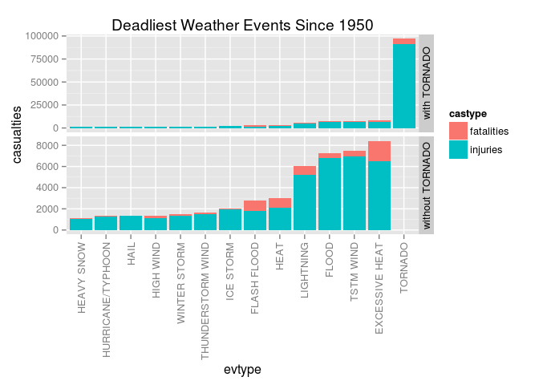
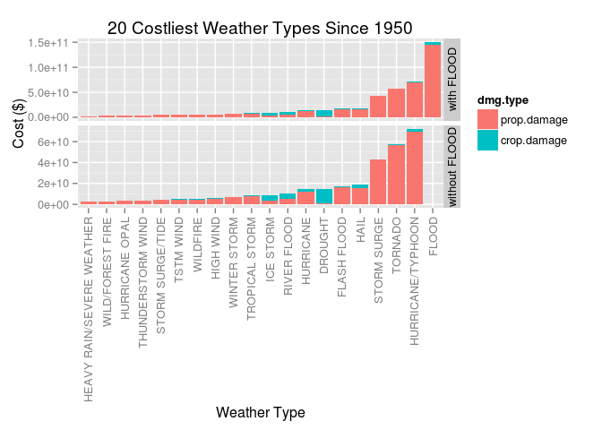

# PA2_template.Rmd
Robert Handsfield  
02/15/2015  


Introduction
----------------------------------------------

Storms and other severe weather events can cause both public health and economic problems for communities and municipalities. Many severe events can result in fatalities, injuries, and property damage, and preventing such outcomes to the extent possible is a key concern.

This project involves exploring the U.S. National Oceanic and Atmospheric Administration's (NOAA) storm database. This database tracks characteristics of major storms and weather events in the United States, including when and where they occur, as well as estimates of any fatalities, injuries, and property damage.


Load Packages
----------------------------------------------

Rquired Packages

* SOAR 
* reshape2
* ggplot2


```r
library(package = "ggplot2");
library(package = "SOAR");
library(package = "reshape2");
```


Get the source data
----------------------------------------------

* NOAA [Storm Data Set]("https://d396qusza40orc.cloudfront.net/repdata%2Fdata%2FStormData.csv.bz2");
* Storm Data [Documentation]("https://d396qusza40orc.cloudfront.net/repdata%2Fpeer2_doc%2Fpd01016005curr.pdf");
* NCDC Storm Events [FAQ]("https://d396qusza40orc.cloudfront.net/repdata%2Fpeer2_doc%2FNCDC%20Storm%20Events-FAQ%20Page.pdf");

The events in the database start in the year 1950 and end in November 2011. In the earlier years of the database there are generally fewer events recorded, most likely due to a lack of good records. More recent years should be considered more complete.

The file is a .bz2 archive, which needs to be extracted.

```r
fileUrl <-"https://d396qusza40orc.cloudfront.net/repdata%2Fdata%2FStormData.csv.bz2";

if ( !("Stormdata.csv.bz2" %in% list.files()) ) {
	download.file(fileUrl, destfile = "./Stormdata.csv.bz2", method = "curl" );
}
```


```r
if ( !("dfStorm" %in% ls() ) ) {
	dfStorm <- read.csv(bzfile("Stormdata.csv.bz2"));	
}
```


Questions
-----------------------------------------------------

Your data analysis must address the following questions:

1. Across the United States, which types of events (as indicated in the EVTYPE variable) are most harmful with respect to population health?
2. Across the United States, which types of events have the greatest economic consequences?

Consider writing your report as if it were to be read by a government or municipal manager who might be responsible for preparing for severe weather events and will need to prioritize resources for different types of events. However, there is no need to make any specific recommendations in your report.

By examining variable names,

```r
names(dfStorm);
```

```
##  [1] "STATE__"    "BGN_DATE"   "BGN_TIME"   "TIME_ZONE"  "COUNTY"    
##  [6] "COUNTYNAME" "STATE"      "EVTYPE"     "BGN_RANGE"  "BGN_AZI"   
## [11] "BGN_LOCATI" "END_DATE"   "END_TIME"   "COUNTY_END" "COUNTYENDN"
## [16] "END_RANGE"  "END_AZI"    "END_LOCATI" "LENGTH"     "WIDTH"     
## [21] "F"          "MAG"        "FATALITIES" "INJURIES"   "PROPDMG"   
## [26] "PROPDMGEXP" "CROPDMG"    "CROPDMGEXP" "WFO"        "STATEOFFIC"
## [31] "ZONENAMES"  "LATITUDE"   "LONGITUDE"  "LATITUDE_E" "LONGITUDE_"
## [36] "REMARKS"    "REFNUM"
```


It seems we should focus on the following columns to answer questions about health and economic impact of weather:

```r
cols <- c("STATE", "EVTYPE", "FATALITIES", "INJURIES", "PROPDMG", "PROPDMGEXP", "CROPDMG", "CROPDMGEXP");
dfEconHealth <- dfStorm[,cols];
```


# 1. Which events are most harmful? ####################
Which EVTYPE values correlate to the highest FATALITIES and INJURIES values?

As a first examination, look at the most harmful weather *events*.

```r
# order descending by injuries, using fatalities as a tie breaker
head( dfEconHealth[with(dfEconHealth, order(-INJURIES, -FATALITIES)),]); 
```

```
##        STATE    EVTYPE FATALITIES INJURIES PROPDMG PROPDMGEXP CROPDMG
## 157885    TX   TORNADO         42     1700   250.0          M       0
## 223449    OH ICE STORM          1     1568    50.0          M       5
## 67884     MA   TORNADO         90     1228   250.0          M       0
## 862634    MO   TORNADO        158     1150     2.8          B       0
## 116011    OH   TORNADO         36     1150   250.0          M       0
## 860386    AL   TORNADO         44      800     1.5          B       0
##        CROPDMGEXP
## 157885           
## 223449          M
## 67884            
## 862634          K
## 116011           
## 860386          K
```

```r
# order descending by fatalities, using injuries as a tie breaker
head( dfEconHealth[with(dfEconHealth, order(-FATALITIES, -INJURIES)),]);
```

```
##        STATE         EVTYPE FATALITIES INJURIES PROPDMG PROPDMGEXP CROPDMG
## 198704    IL           HEAT        583        0     0.0                  0
## 862634    MO        TORNADO        158     1150     2.8          B       0
## 68670     MI        TORNADO        116      785    25.0          M       0
## 148852    TX        TORNADO        114      597    25.0          M       0
## 355128    IL EXCESSIVE HEAT         99        0     0.0                  0
## 67884     MA        TORNADO         90     1228   250.0          M       0
##        CROPDMGEXP
## 198704           
## 862634          K
## 68670            
## 148852           
## 355128           
## 67884
```

Historically, the most injuries during a single event were caused by a TORNADO.  The most fatalities from a single event were caused by HEAT.

For the next step, sum all fatalities and injuries by event type.

```r
dfHealth <- aggregate.data.frame(x = list(dfEconHealth$FATALITIES, dfEconHealth$INJURIES), by = list(dfEconHealth$EVTYPE), FUN = sum);
names(dfHealth) <- c("evtype", "fatalities", "injuries");

# a casualty is an injury or fatality
# sumCasualties = injuries + fatalities
dfHealth$sumCasualties <- dfHealth$fatalities + dfHealth$injuries;

# order descending by injuries
head(dfHealth[with(dfHealth, order(-injuries)),]);
```

```
##             evtype fatalities injuries sumCasualties
## 830        TORNADO       5633    91346         96979
## 854      TSTM WIND        504     6957          7461
## 164          FLOOD        470     6789          7259
## 123 EXCESSIVE HEAT       1903     6525          8428
## 452      LIGHTNING        816     5230          6046
## 269           HEAT        937     2100          3037
```

```r
# order descending by fatalities
head(dfHealth[with(dfHealth, order(-fatalities)),]); 
```

```
##             evtype fatalities injuries sumCasualties
## 830        TORNADO       5633    91346         96979
## 123 EXCESSIVE HEAT       1903     6525          8428
## 147    FLASH FLOOD        978     1777          2755
## 269           HEAT        937     2100          3037
## 452      LIGHTNING        816     5230          6046
## 854      TSTM WIND        504     6957          7461
```

```r
# order descending by total casualties
head(dfHealth[with(dfHealth, order(-sumCasualties)),], 15L); 
```

```
##                evtype fatalities injuries sumCasualties
## 830           TORNADO       5633    91346         96979
## 123    EXCESSIVE HEAT       1903     6525          8428
## 854         TSTM WIND        504     6957          7461
## 164             FLOOD        470     6789          7259
## 452         LIGHTNING        816     5230          6046
## 269              HEAT        937     2100          3037
## 147       FLASH FLOOD        978     1777          2755
## 424         ICE STORM         89     1975          2064
## 759 THUNDERSTORM WIND        133     1488          1621
## 972      WINTER STORM        206     1321          1527
## 354         HIGH WIND        248     1137          1385
## 238              HAIL         15     1361          1376
## 406 HURRICANE/TYPHOON         64     1275          1339
## 304        HEAVY SNOW        127     1021          1148
## 953          WILDFIRE         75      911           986
```


The top 3 weather events that have **injured** the most people since 1950 are
TORNADO, Thunderstorm Wind, FLOOD; while the top 3 events that have **killed** the most people are
TORNADO, EXCESSIVE HEAT, FLASH FLOOD.  A **casualty** is an injury **or** fatality, so let's focus on the *total casualties**.

Select arbitrarily, weather types that have caused at least 1000 casualties since 1950.  
A visual inspection of the ordered casualty list shows 14 weather types that meet this criterion.

```r
# subset the top 14 most harmful weathers
dfHealthWorst <- head(dfHealth[with(dfHealth, order(-sumCasualties)),], 14L); 

# the subset metadata still contains 985 factor levels for 'evtype'
# do the following to remove the unused factor levels
# dfHealthWorst <- data.frame(as.matrix(dfHealthWorst));

# dfHealthWorst$injuries <- as.numeric(dfHealthWorst$injuries);
# dfHealthWorst$fatalities <- as.numeric(dfHealthWorst$fatalities);
# dfHealthWorst$sumCasualties <- as.numeric(dfHealthWorst$sumCasualties);

# there are now only 14 evtype factors, but their levels are in alphabetical order
# re-order the event types by ASCENDING total casualties (for easy plotting later)
dfHealthWorst$evtype = factor(dfHealthWorst$evtype, levels = dfHealthWorst$evtype[order(dfHealthWorst$sumCasualties)], ordered=TRUE);
```

We now have a data frame that looks like

```r
head(dfHealthWorst, 6L);
```

```
##             evtype fatalities injuries sumCasualties
## 830        TORNADO       5633    91346         96979
## 123 EXCESSIVE HEAT       1903     6525          8428
## 854      TSTM WIND        504     6957          7461
## 164          FLOOD        470     6789          7259
## 452      LIGHTNING        816     5230          6046
## 269           HEAT        937     2100          3037
```
While not shown above, the default factor order is the same as the total casualties

Prepare the data frame for plotting

```r
# need to reshape the data frame from wide to long to allow easy plotting

dfTmp <- reshape2::melt(dfHealthWorst[1:3])
```

```
## Using evtype as id variables
```

```r
names(dfTmp) <- c("evtype", "castype", "casualties");

# re-order casualtyType factor so fatality block appears on top in plot
dfTmp <- rbind(dfTmp[15:28,], dfTmp[1:14,]);

# table is now in long form, and evtype factor levels are still in casualty 
# order, which you can verify by 
str(dfTmp);
```

```
## 'data.frame':	28 obs. of  3 variables:
##  $ evtype    : Ord.factor w/ 14 levels "HEAVY SNOW"<"HURRICANE/TYPHOON"<..: 14 13 12 11 10 9 8 7 6 5 ...
##  $ castype   : Factor w/ 2 levels "fatalities","injuries": 2 2 2 2 2 2 2 2 2 2 ...
##  $ casualties: num  91346 6525 6957 6789 5230 ...
```

```r
# copy data to allow facet plotting with and without TORNADO row

wt <- dfTmp; # series with tornado
wot <- dfTmp[c(2:14, 16:28),]; # series without tornado

# add facet factor 
wt$wT <- as.factor("with TORNADO");
wot$wT <- as.factor("without TORNADO");


dfTmp <- rbind(wt,wot);

rm(list = c("wt","wot"));
```

Combining injuries and fatalities, and arbitrarily choosing only events that have caused at least 1000 casualties since 1950, we see that tornadoes are the most harmful by nearly an order of magnitude.  Plotting again, without including tornado casualties, hilights casualty differences from the subsequent 13 most harmful kinds weather events.


Plot

```r
p <- ggplot(data=dfTmp, 
       aes(x=evtype, y=casualties, fill=castype)); # separate bars by castype

p <- p + geom_bar(stat="identity"); # draw bar for each castype

p <- p + facet_grid(wT~., # row for each: w/ TORNADO or w/o TORNADO
	     scales = "free_y"); # uniqe y scale for each facet 

p <- p + theme(axis.text.x = element_text(angle = 90, hjust = 1, vjust = .5), # rotate x-axis text
	       strip.text.y = element_text(angle=90)); # rotate facet label text

p <- p + ggtitle("Deadliest Weather Events Since 1950");

print(p);
```

 


# 2. Which events are most expensive? ##################
Which EVTYPE values correlate to the highest PROPDMG, PROPDMGEXP, CROPDMG, CROPDMGEXP values?

As a first examination, examine the structure of the economic impact columns PROPDMG, PROPDMGEXP, CROPDMG, CROPDMGEXP

```r
dfEcon <- dfEconHealth[,c(2,5:8)]

str(dfEcon);
```

```
## 'data.frame':	902297 obs. of  5 variables:
##  $ EVTYPE    : Factor w/ 985 levels "?","ABNORMALLY DRY",..: 830 830 830 830 830 830 830 830 830 830 ...
##  $ PROPDMG   : num  25 2.5 25 2.5 2.5 2.5 2.5 2.5 25 25 ...
##  $ PROPDMGEXP: Factor w/ 19 levels "","-","?","+",..: 17 17 17 17 17 17 17 17 17 17 ...
##  $ CROPDMG   : num  0 0 0 0 0 0 0 0 0 0 ...
##  $ CROPDMGEXP: Factor w/ 9 levels "","?","0","2",..: 1 1 1 1 1 1 1 1 1 1 ...
```

```r
# order descending by injuries, using fatalities as a tie breaker
# head( dfEcon[with(dfEcon, order(-(PROPDMG + CROPDMG))),]); 
```

The column names and data types suggest a numeric value PROPDMG, multiplied by a power of 10 PROPDMGEXP.

$$
\mbox{Cash Property Damage} = PROPDMG \times {PROPDMGEXP} \mbox{ with } {PROPDMGEXP} = 10^n
$$
  and
$$
\mbox{Cash Crop Damage} = CROPDMG \times {CROPDMGEXP} \mbox{ with } {CROPDMGEXP} = 10^n
$$

Unfortunately, the exponent columns contain non-numeric entries:

```r
unique(dfEcon$PROPDMGEXP); unique(dfEcon$CROPDMGEXP);
```

```
##  [1] K M   B m + 0 5 6 ? 4 2 3 h 7 H - 1 8
## Levels:  - ? + 0 1 2 3 4 5 6 7 8 B h H K m M
```

```
## [1]   M K m B ? 0 k 2
## Levels:  ? 0 2 B k K m M
```

Based on the [conclusions]("https://class.coursera.org/repdata-011/forum/thread?thread_id=39#comment-66") of [Eddie Song] ("https://class.coursera.org/repdata-011/forum/profile?user_id=10852314"), the character codes do represent multipliers,  but the numeric codes are buffer overflows from the preceding columns, and symbols (+,-,?) are errors.  From his analysis, we handle these anomalies by omitting any row that has a non-character exponent code, because it is at least two orders of magnitude smaller than any other damage multiplier.

Additionally, there are only 341 of these problematic rows, comprising less than 0.1% of the data.

```r
numRow <-
length(  grep("[0-8]", dfEcon$PROPDMGEXP )  ) + 
length(  grep("[-?+]", dfEcon$PROPDMGEXP )  ) +
length(  grep("[-?+]", dfEcon$CROPDMGEXP )  ) + 
length(  grep("[0-8]", dfEcon$CROPDMGEXP )  );

numRow;
```

```
## [1] 341
```

```r
numRow / nrow(dfEcon);
```

```
## [1] 0.0003779243
```


Interpret damage exponent character codes as follows:

> Hh ==> 1e2
> Kk ==> 1e3
> Mm ==> 1e6
> Bb ==> 1e9


To make things convenient, add 2 columns containing the values of the damage multipliers for property and crops.  The damage multipliers are calculated according to the formulas above.  
In R, the form **1e6** is classed as numeric, so when possible, use this form in the new multiplier columns.  Also add columns for the **cash damage**, the product of **damage** and **multiplier**.


Remove rows with non-alphabetical damage exponent codes

```r
dfEcon <- dfEconHealth[,c(2,5:8)]

# order of this regex matters; alternatively, try combos of ("[-]" | "[?]" | "[+]")
badRows <- c(  grep("[0-8+?-]", dfEcon$PROPDMGEXP ), grep("[0-8+?-]", dfEcon$CROPDMGEXP )  ); 

# remove unused factor levels part 1
dfEcon$PROPDMGEXP <- as.character(dfEcon$PROPDMGEXP);
dfEcon$CROPDMGEXP <- as.character(dfEcon$CROPDMGEXP);

# subset
dfEcon <- dfEcon[-badRows,];

# clean up workspace
rm(badRows);

# remove unused factor levels part 2
dfEcon$PROPDMGEXP <- as.factor(dfEcon$PROPDMGEXP);
dfEcon$CROPDMGEXP <- as.factor(dfEcon$CROPDMGEXP);

# check factor levels
levels(dfEcon$PROPDMGEXP);
```

```
## [1] ""  "B" "h" "H" "K" "m" "M"
```

```r
levels(dfEcon$CROPDMGEXP);
```

```
## [1] ""  "B" "k" "K" "m" "M"
```


Clean the exponent columns, add the exponent value columns

```r
# initialize new columns
dfEcon$p.dmg.mult <- rep(NA, nrow(dfEcon)); # property damage multiplier
dfEcon$c.dmg.mult <- rep(NA, nrow(dfEcon)); # crop damage multiplier

# convert all character values to upper case
# inspecting str() & unique() shows that only h,m, m,k must be replaced
# gsub fails here, try df index:

dfEcon[grep("h", dfEcon$PROPDMGEXP), "PROPDMGEXP"] = "H";
dfEcon[grep("m", dfEcon$PROPDMGEXP), "PROPDMGEXP"] = "M";

dfEcon[grep("k", dfEcon$CROPDMGEXP), "CROPDMGEXP"] = "K";
dfEcon[grep("m", dfEcon$CROPDMGEXP), "CROPDMGEXP"] = "M";


# insert the correct multiplier values
dfEcon[grep("B", dfEcon$PROPDMGEXP), "p.dmg.mult"] = 1e9;
dfEcon[grep("H", dfEcon$PROPDMGEXP), "p.dmg.mult"] = 1e2;
dfEcon[grep("K", dfEcon$PROPDMGEXP), "p.dmg.mult"] = 1e3;
dfEcon[grep("M", dfEcon$PROPDMGEXP), "p.dmg.mult"] = 1e6;
dfEcon[which(is.na(dfEcon$p.dmg.mult)), "p.dmg.mult"] = 1e0; # no damage code

dfEcon[grep("B", dfEcon$CROPDMGEXP), "c.dmg.mult"] = 1e9;
# dfEcon[grep("H", dfEcon$CROPDMGEXP), "c.dmg.mult"] = 1e2;
dfEcon[grep("K", dfEcon$CROPDMGEXP), "c.dmg.mult"] = 1e3;
dfEcon[grep("M", dfEcon$CROPDMGEXP), "c.dmg.mult"] = 1e6;
dfEcon[which(is.na(dfEcon$c.dmg.mult)), "c.dmg.mult"] = 1e0; # no damage code

# verify the damage exponent factor levels
str(dfEcon);
```

```
## 'data.frame':	901956 obs. of  7 variables:
##  $ EVTYPE    : Factor w/ 985 levels "?","ABNORMALLY DRY",..: 830 830 830 830 830 830 830 830 830 830 ...
##  $ PROPDMG   : num  25 2.5 25 2.5 2.5 2.5 2.5 2.5 25 25 ...
##  $ PROPDMGEXP: Factor w/ 7 levels "","B","h","H",..: 5 5 5 5 5 5 5 5 5 5 ...
##  $ CROPDMG   : num  0 0 0 0 0 0 0 0 0 0 ...
##  $ CROPDMGEXP: Factor w/ 6 levels "","B","k","K",..: 1 1 1 1 1 1 1 1 1 1 ...
##  $ p.dmg.mult: num  1000 1000 1000 1000 1000 1000 1000 1000 1000 1000 ...
##  $ c.dmg.mult: num  1 1 1 1 1 1 1 1 1 1 ...
```

We now have a data frame that looks like this

```r
head(dfEcon);
```

```
##    EVTYPE PROPDMG PROPDMGEXP CROPDMG CROPDMGEXP p.dmg.mult c.dmg.mult
## 1 TORNADO    25.0          K       0                  1000          1
## 2 TORNADO     2.5          K       0                  1000          1
## 3 TORNADO    25.0          K       0                  1000          1
## 4 TORNADO     2.5          K       0                  1000          1
## 5 TORNADO     2.5          K       0                  1000          1
## 6 TORNADO     2.5          K       0                  1000          1
```


Add columns for cash damage, and calculate

```r
# initialize cash damage columns
dfEcon$p.dmg.cash <- rep(NA, nrow(dfEcon)); # property damage cash value
dfEcon$c.dmg.cash <- rep(NA, nrow(dfEcon)); # crop damage cash value

dfEcon$p.dmg.cash <- dfEcon$PROPDMG * dfEcon$p.dmg.mult;
dfEcon$c.dmg.cash <- dfEcon$CROPDMG * dfEcon$c.dmg.mult;
```

Aggregate monetary damages by weather type

```r
dfEconWorst <- aggregate.data.frame(x = list(dfEcon$p.dmg.cash, dfEcon$c.dmg.cash), by = list(dfEcon$EVTYPE), FUN = sum);
names(dfEconWorst) <- c("evtype", "prop.damage", "crop.damage");
```

Calculate cash damage

```r
dfEconWorst$net.damage <- dfEconWorst$prop.damage + dfEconWorst$crop.damage;

# sort df in descending net.damage order
dfEconWorst <- dfEconWorst[with(dfEconWorst, order(-net.damage)),];

# sort evtype levels in ascending net.damage order
dfEconWorst$evtype = with(dfEconWorst, factor(evtype, levels = evtype[order(net.damage)], ordered=TRUE));

# order descending by property damage
head(dfEconWorst[with(dfEconWorst, order(-prop.damage)),], 10L);
```

```
##                evtype  prop.damage crop.damage   net.damage
## 162             FLOOD 144657709807  5661968450 150319678257
## 402 HURRICANE/TYPHOON  69305840000  2607872800  71913712800
## 826           TORNADO  56936985483   364950110  57301935593
## 662       STORM SURGE  43323536000        5000  43323541000
## 146       FLASH FLOOD  16140811717  1420727100  17561538817
## 235              HAIL  15732262277  3000954453  18733216730
## 393         HURRICANE  11868319010  2741910000  14610229010
## 840    TROPICAL STORM   7703890550   678346000   8382236550
## 968      WINTER STORM   6688497250    26944000   6715441250
## 351         HIGH WIND   5270046260   638571300   5908617560
```

```r
# order ascending by crop damage
head(dfEconWorst[with(dfEconWorst, order(-crop.damage)),], 10L);
```

```
##                evtype  prop.damage crop.damage   net.damage
## 87            DROUGHT   1046106000 13972566000  15018672000
## 162             FLOOD 144657709807  5661968450 150319678257
## 582       RIVER FLOOD   5118945500  5029459000  10148404500
## 420         ICE STORM   3944927810  5022110000   8967037810
## 235              HAIL  15732262277  3000954453  18733216730
## 393         HURRICANE  11868319010  2741910000  14610229010
## 402 HURRICANE/TYPHOON  69305840000  2607872800  71913712800
## 146       FLASH FLOOD  16140811717  1420727100  17561538817
## 132      EXTREME COLD     67737400  1292973000   1360710400
## 203      FROST/FREEZE      9480000  1094086000   1103566000
```

```r
# order ascending by net damage
head(dfEconWorst[with(dfEconWorst, order(-net.damage)),], 10L);
```

```
##                evtype  prop.damage crop.damage   net.damage
## 162             FLOOD 144657709807  5661968450 150319678257
## 402 HURRICANE/TYPHOON  69305840000  2607872800  71913712800
## 826           TORNADO  56936985483   364950110  57301935593
## 662       STORM SURGE  43323536000        5000  43323541000
## 235              HAIL  15732262277  3000954453  18733216730
## 146       FLASH FLOOD  16140811717  1420727100  17561538817
## 87            DROUGHT   1046106000 13972566000  15018672000
## 393         HURRICANE  11868319010  2741910000  14610229010
## 582       RIVER FLOOD   5118945500  5029459000  10148404500
## 420         ICE STORM   3944927810  5022110000   8967037810
```

Prepare the data frame for plotting

```r
dfTmp <- dfEconWorst[1:20,1:3];

# reshape from wide to long
dfTmp <- reshape2::melt(dfTmp);
```

```
## Using evtype as id variables
```

```r
names(dfTmp) <- c("evtype", "dmg.type", "dmg.amount");

# copy data to allow facet plotting with and without FLOOD row
wf <- dfTmp; # series with flood
wof <- dfTmp[c(2:20, 22:40),]; # series without flood

# add facet factor 
wf$wF <- as.factor("with FLOOD");
wof$wF <- as.factor("without FLOOD");

dfTmp <- rbind(wf,wof);

rm(list = c("wf","wof"));
```

Plot

```r
p <- ggplot(data=dfTmp, aes(x=evtype, y=dmg.amount, fill=dmg.type)); # separate bars by castype

p <- p + geom_bar(stat="identity"); # draw bar for each castype

p <- p + theme(axis.text.x = element_text(angle = 90, hjust = 1, vjust = .5),  strip.text.y = element_text(angle=90)); # rotate facet label text);

p <- p + facet_grid(wF~., # row for each: w/ FLOOD or w/o FLOOD
	     scales = "free_y"); # uniqe y scale for each facet 

p <- p + ylab("Cost ($)") + xlab("Weather Type");

p <- p + ggtitle("20 Costliest Weather Types Since 1950");

print(p);
```

 

Property damage makes up most of the economic costs due to weather.  Flooding is costliest, costing twice as much in damage as the next costliest, hurricane/typhoon.  Omitting flooding magnifies the differences between the remaining types.


Title
----------------------------------------------
Your document should have a title that briefly summarizes your data analysis

Synopsis
----------------------------------------------
Immediately after the title, there should be a synopsis which describes and summarizes your analysis in at most 10 complete sentences.

Data Processing
----------------------------------------------
There should be a section titled Data Processing which describes (in words and code) how the data were loaded into R and processed for analysis. In particular, your analysis must start from the raw CSV file containing the data. You cannot do any preprocessing outside the document. If preprocessing is time-consuming you may consider using the cache = TRUE option for certain code chunks.


Results
----------------------------------------------


