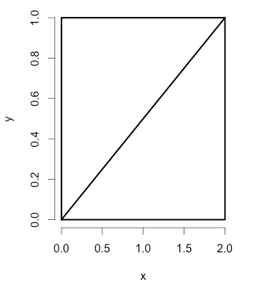
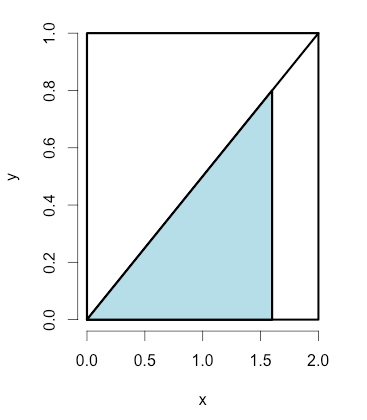

# Swirl Assignments - Statistical Inference

Install the Statistical Inference swirl course
```{r eval=FALSE}
# load
library(swirl)
# install course
install_from_swirl("Statistical Inference")

# load course
swirl()
```


## Week 1

### Introduction
Username for this session is 'R'.

Which of the following is NOT an example of statistical inference?  
__2: Recording the results of a statistics exam__ involves concrete data that doesn't require any inference or generalization.

Which of the following would NOT be a source of bad data?  
__4: A randomly selected sample of population__

So with statistical inference we use data to draw general conclusions about a population. Which of the following would a scientist using
statistical inference techniques consider a problem?  
__3: Contaminated data__

Which of the following is NOT an example of statistical inference in action?  
__2: Counting sheep__

We want to emphasize a couple of important points here. First, a statistic (singular) is a number computed from a sample of data. We use statistics to infer information about a population. Second, a random variable is an outcome from an experiment. Deterministic processes, such as computing means or variances, applied to random variables, produce additional random variables which have their own distributions. It's important to keep straight which distributions you're talking about.

Finally, there are two broad flavors of inference. The first is __frequency,__ which uses "long run __proportion of times an event occurs__ in independent, identically distributed repetitions." The second is Bayesian in which the __probability estimate__ for a hypothesis __is updated as additional evidence is acquired.__ Both flavors require an understanding of probability so that's what the next lessons will cover.

__Assignment Token:__ 2Fob468GfJv0AfeV

---

### Probability1

The first step in understanding probability is to see if you understand what outcomes of an experiment are possible. For instance, if you were rolling a single, fair die once, how many outcomes are possible?  
__1: 6__

The probability of a particular outcome of an experiment is the ratio of the number of ways that outcome can occur to all possible outcomes of the experiment. Since there are 6 possible outcomes to the experiment of rolling a die, and we assume the die is fair, each outcome is equally likely. So what is the probability of rolling a 2?  
__3: 1/6__

What is the probability of rolling an even number?  
__4: 1/2__

If A and B are two independent events then the probability of them both occurring is the product of the probabilities. $P(A&B) = P(A) * P(B)$ Suppose you rolled the fair die twice in succession. What is the probability of rolling two 4's?  
__3: 1/36__

Suppose you rolled the fair die twice. What is the probability of rolling the same number two times in a row?  Since we don't care what the outcome of the first roll is, its probability is 1. The second roll of the dice has to match the outcome of the first, so that has a probability of 1/6. The probability of both events occurring is 1 * 1/6.  
__1: 1/6__

Now consider the experiment of rolling 2 dice, one red and one green. Assume the dice are fair and not loaded. How many distinct outcomes are possible?  
__3: 36__

Rolling these two dice, what's the probability of rolling a 10?  
__2: 3/36__

What sum is the most likely when rolling these two dice?  
__3: 7__

The probability of at least one of two events, A and B, occurring is the sum of their individual probabilities minus the probability of their intersection. P(A U B) = P(A) + P(B) - P(A&B). It's easy to see why this is. Calculating P(A) and P(B) counts outcomes that are in both A and B twice, so they're overcounted. The probability of the intersection of the two events, denoted as A&B, must be subtracted from the sum.

Back to rolling two dice. Which expression represents the probability of rolling an even number or a number greater than 8? The probability of rolling an even number is 1/2 or 18/36. There are 10 ways of rolling a number greater than '8' - 4 ways for rolling '9', 3 for '10', 2 for '11' and 1 for '12'. How big is the intersection between rolling an even number and those greater than '8'?

9	4,5 3,6
10	4,6 5,5
11    	5,6
12   	6,6

__4: (18+10-4)/36__

It follows that if A and B are disjoint or mutually exclusive, i.e. only one of them can occur, then P(A U B) = P(A)+P(B).

Which of the following expressions represents the probability of rolling a number greater than 10?  
__2: (2+1)/36__

Use the answer to the previous question and the fact that the sum of all outcomes must sum to 1 to determine the probability of rolling a number less than or equal to 10.  
__33/36__

A deck of cards is a set of 52 cards, 4 suits of 13 cards each. There are two red suits, diamonds and hearts, and two black suits, spades and clubs. Each of the 13 cards in a suit has a value - an ace which is sometimes thought of as 1, a number from 2 to 10, and 3 face cards, king, queen, and jack. We've created a deck in R for you. Type 'deck' to see it now.

When drawing a single card, how many outcomes are possible?  
__52__

What is the probability of drawing a jack?  
__4/52__

If you're dealt a hand of 5 cards, what is the probability of getting all 5 of the same value?  
__0__

What is the probability of drawing a face card?  
__12/52__

Suppose you draw a face card and don't replace it in the deck. What is the probability that when you draw a second card it also will be a face card?  
__1: 11/51__

Suppose you draw a face card and don't replace it in the deck. What is the probability that when you draw a second card it also will be a face card of the same suit?  
__2/51__

__Assignment Token:__ 8VfbrCQNdcQYVALS

---

### Probability2

(Slides for this and other Data Science courses may be found at github [https://github.com/DataScienceSpecialization/courses](https://github.com/DataScienceSpecialization/courses). If you care to use them, they must be downloaded as a zip file and viewed locally. This lesson corresponds to Statistical_Inference/Probability.)

Recall that a random variable is a numerical outcome of an experiment. It can be discrete (take on only a countable number of possibilities), or continuous (take on any value on the real line or subset of it).

If you had a ruler of infinite precision, would measuring the height of adults around the world be continuous or discrete? 'Infinite precision' is the key. The set of possible heights is infinite.  
__2: continuous__

Is the drawing of a hand of cards continuous or discrete?  
__1: discrete__

Continuous random variables are usually associated with measurements of time, distance, or some biological process since they can take on any value, often within some specified range. Limitations of precision in taking the measurements may imply that the values are discrete; we in fact consider them __continuous__.

A probability ___mass___ function (PMF) gives the probability that a ___discrete___ random variable is exactly equal to some value.

For instance, suppose we have a coin which may or may not be fair. Let x=0 represent a 'heads' outcome and x=1 represent a 'tails' outcome of a coin toss. If p is the probability of 'heads' which of the following represents the PMF of the coin toss, $1: (p^{1-x})*(1-p)^x$ or $2: (p^x)*(1-p)^{1-x}$?  The variable x is either 0 (heads) or 1 (tails).  

If $p$ is defined as the probability of _heads_ (x=0), then the PMF must simplify to $p$ when substituting in $x=0$.  
__$1: (p^{1-x})*(1-p)^x$__

A probability ___density___ function is associated with a ___continuous___ random variable. To quote from Wikipedia, it "is a function that describes the relative likelihood for this random variable to take on a given value. The probability of the random variable falling within a particular range of values is given by ... the area under the density function but above the horizontal axis and between the lowest and greatest values of the range."

We'll repeat two requirements of a probability density function. It must be __nonnegative everywhere__, and the __area under it must equal one__."

Consider this figure - a rectangle with height 1 and width 2 with a diagonal line drawn from the lower left corner (0,0) to the upper right (2,1). The area of the entire rectangle is 2 and elementary geometry tells us that the diagonal divides the rectangle into 2 equal areas.



Could the diagonal line represent a probability density function for a random variable with a range of values between 0 and 2? Assume the lower side of the rectangle is the x axis.

The triangle in question is nonnegative and has total area of one.  
__1: Yes__

Now consider the shaded portion of the triangle - a smaller triangle with a __base of length 1.6__ and height determined by the diagonal. 



What proportion of the big triangle is shaded?  
__3: 0.8__

What is the area of the blue triangle?  
__0.64__

What is the probability that pebbles thrown at the bigger triangle will hit the blue portion?  
__0.64__

This artificial example was to meant to illustrate a simple probability density function (PDF). Most PDF's have underlying formulae more
complicated than lines. We'll see more of these in future lessons.

The __cumulative distribution function__ (CDF) of a random variable X, either discrete or continuous, is the function F(x) equal to the probability that X is __less than or equal to x__. In the example above, the area of the blue triangle represents the probability that the random variable was less than or equal to the value 1.6.

In the triangle example from above, which of the following expressions represents F(x), the CDF?  
$x$ is the base, $y = x/2$ is the height, triangle area is $bh / 2 = x * \frac{x}{2} * \frac{1}{2}$  
__1: $x*x/4$__

If you're familiar with calculus you might recognize that when you're computing areas under curves you're actually integrating functions. When the random variable is continuous, as in the example, the PDF is the derivative of the CDF. So integrating the PDF (the line represented by the diagonal) yields the CDF. When you evaluate the CDF at the limits of integration the result is an area.

To see this in the example, we've defined the function mypdf for you. This is the equation of the line represented by the diagonal of the rectangle $F(x) = x/2$ As the PDF, it is the derivative of F(x), the CDF. The function is stored in your R environment in the 'mypdf' variable. Look at mypdf now. Type 'mypdf' at the R prompt.  

$ mypdf  
__function(x){x/2}__  
<environment: 0x104ec9508>

Now use the R function `integrate` to integrate mypdf with the parameters `lower` equal to `0` and `upper` equal to `1.6`. See if you get the same area (probability) you got before.  

$ `integrate(mypdf, lower = 0, upper = 1.6)`
0.64 with absolute error < 7.1e-15  # This checks out, the area is 0.64

The __survivor function__ S(x) of a random variable X is defined as the function of x equal to the probability that the random variable X is __greater than the value x__. This is the __complement of the CDF__ F(x), in our example, the portion of the lower triangle that is not shaded.

In our example, which of the following expressions represents the survival function?  
__3: $1-x^2/4$__

The __quantile v__ of a CDF is the point $x_v$ at which the CDF has the value v $(\{x_v,v\} \simeq \{x,y\})$. More precisely, $F(x_v)=v$. A percentile is a quantile in which v is expressed as a percentage.

In what percentile is the median?  
__1: $50^{th}$__

What is the 50th percentile of the CDF $F(x)=(x^2)/4$ from the example above?  
Solve $F(x) = 0.5$ for $x$.  
__1.41 or, $\sqrt 2$__

What does this mean with respect to the pebbles we're tossing at the triangle?
__4: Half of it falls to the left of 1.41__ (because 1.41 is the median)

Some important points:

1. A probability model connects data to a population using assumptions.
2. Be careful to distinguish between population medians and sample medians.
3. A sample median is an estimator of a population median (the estimand).

__1Assignment Token:__ k8sfLrukUryPHfam

---

### ConditionalProbability

Conditional Probability. (Slides for this and other Data Science courses may be found at github `https://github.com/DataScienceSpecialization/courses/`. If you care to use them, they must be downloaded as a zip file and viewed locally. This lesson corresponds to `06_Statistical_Inference/03_Conditional_Probability`.)

In this lesson, as the name suggests, we'll discuss conditional probability.

If you were given a fair die and asked what the probability of rolling a 3 is, what would you reply?  
__1: 1/6__

Suppose the person who gave you the dice rolled it behind your back and told you the roll was odd. Now what is the probability that the roll was a 3?  
__5: 1/3__

The probability of this second event is conditional on this new information, so the probability of rolling a 3 is now one third.

We represent the conditional probability of an event A given that B has occurred with the notation $P(A|B)$. More specifically, we define the conditional probability of event A, given that B has occurred with the following.

$$P(A|B) = P(A \& B) / P(B)$$

$P(A|B)$ is the probability that __BOTH__ A and B occur divided by the probability that B occurs.

Back to our dice example. Which of the following expressions represents $P(A\&B)$, where A is the event of rolling a 3 and B is the event of the roll being odd?  
__1: 1/6__

Which of the following expressions represents $P(A\&B)/P(B)$, where A is the event of rolling a 3 and B is the event of the roll being odd?  
__2: (1/6)/(1/2)__

From the definition of $P(A|B)$, we can write $P(A\&B) = P(A|B) * P(B)$.  Let's use this to express $P(B|A)$: 
$$P(B|A) = P(B\&A)/P(A) = P(A|B) * P(B)/P(A)$$ 
This is a simple form of Bayes' Rule which relates the two conditional probabilities.

Suppose we don't know $P(A)$ itself, but only know its conditional probabilities, that is, the probability that it occurs if B occurs and the probability that it occurs if B doesn't occur. These are $P(A|B)$ and $P(A~| \sim B)$, respectively. We use ~B to represent 'not B' or 'B complement' We can then express $P(A) = P(A|B) * P(B) + P(A~| \sim B) * P( \sim \not B)$ and substitute this is into the denominator of Bayes' Formula.

$$P(B|A) = P(A|B) * P(B) / ( P(A|B) * P(B) + P(A~|\sim B) * P(\sim B) )$$

Bayes' Rule has applicability to medical diagnostic tests. We'll now discuss the example of the HIV test from the slides.

Suppose we know the accuracy rates of the test for both the positive case (positive result when the patient has HIV) and negative (negative test result when the patient doesn't have HIV). These are referred to as test sensitivity and specificity, respectively.
Let 'D' be the event that the patient has HIV, and let '+' indicate a positive test result and '-' a negative. What information do we know? Recall that we know the accuracy rates of the HIV test.  

__2: $P(+ ~|~ D) and P(- ~|~ \sim D)$__ We know the probabilities of positive test given disease, and negative test given health.

Suppose a person gets a positive test result and comes from a population with a HIV prevalence rate of .001. We'd like to know the probability that he really has HIV. Which of the following represents this? By Bayes' Formula, $P(D|+) = P(+|D) * P(D) / ( P(+|D) * P(D) + P(+|\simD) * P(\simD) )$  
__2: P(D ~|~ +)__ probabilty of disease, given a positive test

We can use the prevalence of HIV in the patient's population as the value for P(D). Note that since P(~D)=1-P(D) and P(+|~D) = 1-P(-|~D) we can __calculate P(D|+)__. In other words, we know values for all the terms on the right side of the equation. Let's do it!

Disease prevalence is .001. Test sensitivity (+ result with disease) is 99.7% and specificity (- result without disease) is 98.5%. First
compute the numerator, P(+|D)*P(D). (This is also part of the denominator.)  
$P(D)=.001$,  $P(+ ~|~ D) = .997$,  $P(- ~|~ \sim D) = .985$  
__$ .001*.997 = 0.000997__

Now solve for the remainder of the denominator, P(+|~D)*P(~D).  Remember that P(+|~D) = 1-P(-|~D) and P(~D)=1-P(D).  
$P(\simD)= .999$,  $P(+ ~|~ \sim D) = .015$,  $P(+ ~|~ \sim D)*P(\sim D) = .015 * .999$  
__.015*.999 = 0.014985__

Now put the pieces together to compute the probability that the patient has the disease given his positive test result, P(D|+). Plug your last two answers into the formula $P(+|D) * P(D) / ( P(+|D) * P(D) + P(+|\simD) * P(\simD) )$ to compute P(D|+).  Divide $(.997*.001) by (.997*.001 + .015*.999)$  
__$ .000997/(.000997 + .014985)  = .06__

So the patient has a 6% chance of having HIV given this positive test result. The expression P(D|+) is called the positive predictive value. Similarly, P(~D|-), is called the negative predictive value, the probability that a patient does not have the disease given a negative test result.

The diagnostic likelihood ratio of a positive test, $DLR_+$, is the ratio of the two + conditional probabilities, one given the presence of disease and the other given the absence. Specifically, $DLR_+ = P(+|D) / P(+| \sim D)$. Similarly, the $DLR_-$ is defined as a ratio. Which of the following do you think represents the $DLR_-$?  
__4: $P(-|D) / P(-|\sim D)$__

Recall that P(+|D) and P(-|~D), (test sensitivity and specificity respectively) are accuracy rates of a diagnostic test for the two possible results. They should be close to 1 because no one would take an inaccurate test, right? Since DLR_+ = P(+|D) / P(+|~D) we recognize the numerator as test sensitivity and the denominator as the complement of test specificity.

Now a little more about likelihood ratios. Recall Bayes Formula. P(D|+) = P(+|D) * P(D) / ( P(+|D) * P(D) + P(+|~D) * P(~D) ) and notice that if we replace all occurrences of 'D' with '~D', the denominator doesn't change. This means that if we formed a ratio of $P(D|+)$ to $P(\~D|+)$ we'd get a much simpler expression (since the complicated denominators would cancel each other out). Like this....

$$P(D|+) / P(\~D|+) = P(+|D) * P(D) / (P(+|\~D) * P(\~D)) = P(+|D)/P(+|\~D) * P(D)/P(\~D)$$

The left side of the equation represents the post-test odds of disease given a positive test result. The equation says that the post-test odds of disease equals the pre-test odds of disease (that is, $P(D)/P(~D)$ ) times the $DLR_+$.

Taking the formula above and replacing the '+' signs with '-' yields a formula with the DLR_-. Specifically, P(D|-) / P(~D|-) = P(-|D) /
 P(-|~D) * P(D)/P(~D). As with the positive case, this relates the odds of disease post-test, P(D|-) / P(~D|-), to those of disease pre-test, P(D)/P(~D).
 
The equation P(D|-) / P(~D|-) = P(-|D) / P(-|~D) * P(D)/P(~D) says what about the post-test odds of disease relative to the pre-test odds of disease given negative test results?  
__: post-test odds are less than pre-test odds__

Let's cover some basics now.

Two events, A and B, are independent if they have no effect on each other. Formally, P(A&B) = P(A)*P(B). It's easy to see that if A and B are independent, then P(A|B)=P(A). The definition is similar for random variables X and Y.

We've seen examples of independence in our previous probability lessons. Let's review a little. What's the probability of rolling a '6' twice in a row using a fair die?  
__3: 1/36__

You're given a fair die and asked to roll it twice. What's the probability that the second roll of the die matches the first?  
__3: 1/6__

If the chance of developing a disease with a genetic or environmental component is p, is the chance of both you and your sibling developing that disease p*p?  

We'll conclude with iid. Random variables are said to be iid if they are independent and identically distributed. By independent we mean
 "statistically unrelated from one another". Identically distributed means that "all have been drawn from the same population distribution". Random variables which are iid are the default model for random samples and many of the important theories of statistics assume that variables are iid. We'll usually assume our samples are random and variables are iid.


### Expectations


