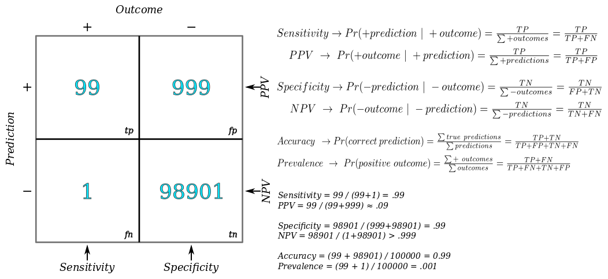
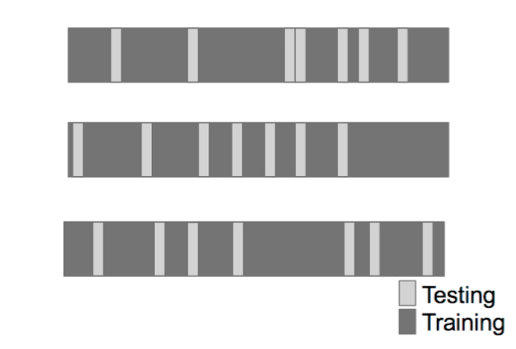
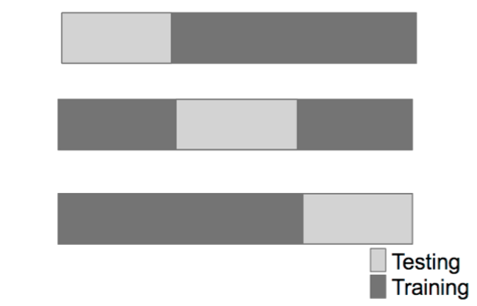
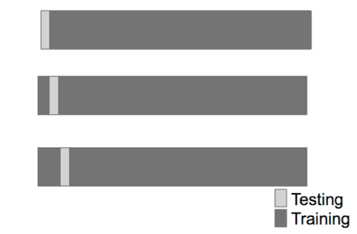

```{r setup, include=TRUE, echo=FALSE}
knitr::opts_chunk$set(fig.align = 'center')
```

The R __caret__ (__C__lassification __A__nd __R__egression __T__raining) package includes functions to streamline complex classification and regression problems. Most R machine learning makes use of this package.

Install with: 
```{r, cache=TRUE, message=FALSE}
if( !("ggplot2" %in% installed.packages()) ) {
	install.packages("ggplot2"); #, dependencies = c("Depends", "Suggests"), repos = "http://cran.us.r-project.org");
}
library("ggplot2");
```

# What is prediction?
An oft-overlooked issue in machine learning is choosing which data to include in the training set. An example is the Google Flu Trends Algorithm, which attempted to predict influenza epidemiology form search terms. However, the designers did not anticipate that population search queries change over time. Their lack of accurate foresight caused the algorithm to fail.

## Components of a Predictor

> QUESTION -> INPUT DATA -> FEATURES -> ALGORITHM -> PARAMETERS -> EVALUATION

## Designing a Question

All problems start with a general question. To design a well-posed question, __always__ start off by answering

1. What am I trying to predict?
2. What am I trying to predict it with? 

This is somewhat contrary to the generally true _more data is better_ approach to machine learning. How much more efficient is a well-posed question?

### Example 1

* General question: _Can I automatically detect SPAM?_
* Well-posed question: _Can I use __quantitative characteristics of the emails__ to classify them as __SPAM or HAM___?

Suitable input data may be found in the [`kernlab::spam`](https://cran.r-project.org/web/packages/kernlab/kernlab.pdf) dataset
```{r, cache=TRUE, message=FALSE}
if( !("kernlab" %in% installed.packages()) ) {
	install.packages("kernlab", repos = "http://cran.us.r-project.org");
}
library("kernlab");
data(spam);

# Columns 1:55 are frequency of unigram appearance
head(spam, 3L)[1:10];
```

#### Features
Possible features could be the frequency with which certain words appear (columns 1:55 of `spam`).

```{r, eval=TRUE}
plot(
	density( spam$your[spam$type=='nonspam'] ), 
	col='blue', main='Spam vs Nonspam', 
	xlab='Frequency of the word "your"', ylab='Word Density' 
    );

lines( density(spam$your[spam$type=="spam"]), col='red' );
legend(x="topright", pch=c(19), legend = c("Spam", "Nonspam"), col = c("red", "blue"))
```

Spam tends to contain more instances of the word _your_ than nonspam.

#### Algorithm

An algorithm might establish some cutoff value $C$; an email that contains more than $C$ instances of the word _"your"_ is labeled spam.

```{r}
plot( 
	density( spam$your[spam$type=='nonspam'] ), 
	col='blue', main='Spam vs Nonspam, C = 0.5', 
	xlab='Frequency of the word "your"', ylab='Word Density'
     );

lines( density(spam$your[spam$type=="spam"]), col='red' );
legend(x="topright", pch=c(19), legend = c("Spam", "Nonspam"), col = c("red", "blue"));
abline(v=0.5, col='black', lwd=3);
```

```{r}
options(digits = 3) # set precision for display

prediction <- ifelse(spam$your > 0.5, "spam", "nonspam")
table(prediction, spam$type) / length(spam$type) 
```
#### Parameters
The __parameters__ would appear in the _implementation_ of the algorithm. We would manipulate the parameters to make the algorithm return different values for $C$.

#### Evaluation
Always decide on some __single-valued__ metric to evaluate an algorithm. The metric could be a measurement of accuracy, error-rate, or training speed. In this example, we evaluate the fraction of hams and spams that are correctly classified (true positives and true negatives.)

```{r, echo=FALSE}
table(prediction, spam$type) / length(spam$type) 
```

$$\mbox{Accuracy} = tp + tn \approx 0.292 + 0.459 = 0.751$$


# Relative Importance of Steps
The components of a predictor are, in order of importance:

> QUESTION -> INPUT DATA -> FEATURES -> ALGORITHM

meaning that a machine learning model will perform best when it

1. Answers a well-posed question
2. Receives input data that is sufficient to answer that question
3. Utilizes the necessary subset of the input data, and no more
4. Implements a practical algorithm

* QUESTION
	+ A well-posed question has a clear desired outcome that can be answered with a sufficient, clearly defined data set.
	+ A well-posed question is also narrow in scope and restricted to well-defined knowledge domains

* INPUT DATA
	+ A good set of input data can be difficult to obtain
	+ In some cases, mostly in Web & IT, a data set already exists (movie reviews)
	+ In other cases, obtaining data can be difficult or expensive (gene expression data)
	+ In nearly all cases, more training examples lead to better model performance

* FEATURES
	+ Automated feature selection, right now, doesn't work very well 
	+ Good feature selection requires domain expertise and accomodates data-specific quirks
	+ Good feature selection should also achieve data compression & efficient data subsetting
	
* ALGORITHM
	+ As training examples grow to infinity, all algorithms predict with equal accuracy
	+ A _practical_ algorithm is fast, simple, scalable, _interpretable_ and accurate for a finite data set
	
All prediction problems involve tradeoffs between algorithm traits. Generally, improving accuracy comes at the expense of speed, simplicity, scalability, or interpretability. Interpretability matters because _people_ need to use predictions to do something. Most people will find some way to fuck it up all by themselves, don't compound the problem by writing a predictor that is difficult to interpret.

# Types of Sample Errors
A prediction model will always have different error rates on the training set, validation set, and any test sets. These are generally known as training error, validation error, and test set errors. In biostatistics, apparently, they use different terms.

* _In Sample_ Error = Training Error
* _Out of Sample_ (aka _Generalization_) Error (aka Bias??) = Error on any other set (validation or test)

Keep in mind that:

1. We only care about validation and test (Out Sample) errors
2. In-Sample is always less than Out-Sample error due to overfitting

### Example 2
Let's see how different error types behave on the spam dataset. Features are the average number of capital letters.
```{r}
set.seed(333)

# subset the spam data
smallSpam <- spam[sample(dim(spam)[1], size=10), ]
spamLabel <- (smallSpam$type == "spam")*1 + 1

plot( 
	smallSpam$capitalAve, col=spamLabel,
	ylab="Avg Num of Capital Letters",
	main='Spam vs Nonspam, C1 = 2.7, C2 = 2.4'
    );

legend(x="topright", pch=c(1), legend = c("Spam", "Nonspam"), col = c("red", "black"));
abline(h=2.7, col='red', lwd=1); abline(h=2.4, col='black', lwd=1);

```

There are 5 each of Spam and Nonspam email.

---

#### Create an Algorithm
We can interpret the cutoffs $C_1$ and $C_2$ to obtain a few different __prediction rules__, each resulting in a different accuracy tradeoff.

| 	Rule 1					| 	Rule 2				|
| --------------------------------------------- | ------------------------------------- |
| (`capitalAve` > 2.70) = "Spam"		| (`capitalAve` > 2.70) = "Spam"	|
| (`capitalAve` < 2.40) = "Nonspam"		| (`capitalAve` ≤ 2.70) = "Nonspam"	|
| (2.40 ≤ `capitalAve` ≤ 2.45) = "Spam"		|					|
| (2.45 ≤ `capitalAve` ≤ 2.70) = "Nonspam"	|					|

Rule 1 is complex, and may be prone to overfitting. Rule 2 is simple, and may scale better, but may be less accurate. 

* You can think of each condition as a boolean feature: _"Is this data point greater than 2.7?"_, etc. Thus Rule 1 has twice as many features as Rule 2.

##### Apply the Algorithm
What happens when we computationally apply the rules to our spam subset?
```{r}
# RULE 1
rule1 <- function(x) {
  prediction <- rep(NA, length(x))
  prediction[x > 2.7] <- "spam"
  prediction[x < 2.4] <- "nonspam"
  prediction[(x>=2.4  &  x<=2.45)] <- "spam"
  prediction[(x>2.45  &  x<=2.70)] <- "nonspam"

  return(prediction)
}

table( rule1(smallSpam$capitalAve), smallSpam$type  )
```

```{r}
# RULE 2
rule2 <- function(x) {
  prediction <- rep(NA, length(x))
  prediction[x > 2.7] <- "spam"
  prediction[x <= 2.7] <- "nonspam"

  return(prediction)
}

table( rule2(smallSpam$capitalAve), smallSpam$type  )
```

Rule 1 perfectly fits the small subset: 5 each of Spam and Nonspam. Rule 2 is slightly inaccurate. How do the rules scale to the full dataset?

#### __Evaluate__ the Rules

> RULE 1
```{r cache=TRUE, results='hold'}
# RULE 1
sum( rule1(spam$capitalAve) == spam$type  )
mean( rule1(spam$capitalAve) == spam$type  )
table( rule1(spam$capitalAve), spam$type  )
```

---

> RULE 2
```{r cache=TRUE, results='hold'}
# RULE 2
sum( rule2(spam$capitalAve) == spam$type  )
mean( rule2(spam$capitalAve) == spam$type  )
table( rule2(spam$capitalAve), spam$type  )
```

On the full data set, Rule 2 actually performs better, with +.001 better classification accuracy. What happened?

Rule 1, with twice as many features, is overfitting to the training data. Consequently, it does not generalize well to new data sets. (Trades small _In-Sample_ for large _Out-Sample_ error).


# Prediction Study Design

A good procedure for designining a predictor can be broken into 5 steps.

1. Define an error metric
	+ squared error, (root) mean-squared error, residual, etc.
2. Split data into training, validation, and test sets
3. Subset features ($\theta$) from the training set
4. Choose a __prediction function__
	+ aka hypothesis function ${h_\theta}(x)$
5. Apply the prediction function
	+ if no validation, apply 1x to test set (to avoid test set bias)
	+ if validation, apply to test then refine or apply 1x to validation set

Once you have a working predictor, you should check it against known benchmarks. If anybody else has worked on a predictor, there will be set of benchmarks for various parameter values: high regularization vs zero regularization, random initialization vs zero initialization, random weight vs zero weight, etc.

* [http://www.heritagehealthprize.com/c/hhp/leaderboard](http://www.heritagehealthprize.com/c/hhp/leaderboard)
* [http://www.kaggle.com](http://www.kaggle.com)

If your algorithm is performing alarmingly well or poorly, take a close look at the benchmarks to troubleshoot.

## Data Sets and Segmentation

When hosting a machine learning study (competition), reserve your test set for final evaluations only; don't show it to the study participants.

Avoid very small sample sizes; they never lead to good predictors, because statistics.

* Large Data Sets:
	+ 60% training
	+ 20% validation
	+ 20% test
* Medium Data Sets:
	+ 60% training
	+ 40% testing
* Small Data Sets:
	+ Cross Validate
	+ Report the caveat of small sample size
* Time-Series Data Sets: 
	+ Predictions are time-dependent
	+ Sample the train/val/test data in chunks to preserve time series integrity
	+ In finance this is called [_backtesting_]()

All data subsets should always be randomly sampled, and accurately reflect the structure of the problem (feature choice??).

# Types of Model Errors

The foundational concepts of model error are _true positives_ and _true negatives_, both examples of correct classifications. From the foundation follow the concepts of _false positives_ and _false negatives_. A model's performance can be robustly summarized in a __2x2 Table__  

---



---

It's useful to understand the 2x2 Metrics like this:

* Sensitivity = fraction of true positives per actual positives 
	+ (% of actual positives we got right)
	+ (given an actual positive, what is the probability we predict it correctly?)
* Specificity = fraction of true negatives per actual negatives 
	+ (% of actual negatives we got right)
	+ (given an actual negitive, what is the probability we predict it correctly?)

* Positive Predictive Value = fraction of true positives per predicted positves
	+ (% of predicted positves that are correct)
	+ (given a positive prediction, what is the probability it is correct?)
* Negitive Predictive Value = fraction of true negatives per predicted negatives 
	+ (% of predicted negatives that are correct)
	+ (given a negitive prediction, what is the probability it is correct?)
	
* Accuracy = fraction of correct predictions per all predictions
	+ (% of predictions we got right)
	+ (given any prediction, what is the probability it is correct?)
	
* Prevalence = fraction of actual positives per all predictions
	+ (% of actual positives in the entire population)
	+ (given any outcome, what is the probability it is positive?)

## Error Metrics

> Mean-Squared Error  
* continuous data, sensitive to outliers
$$MSE = {1 \over n}{\sum_{i=1}^{n}(Prediction_i - Actual_i)^2}$$

> Root Mean-Squared Error (RMS)  
* continuous data, sensitive to outliers
$$RMS = \sqrt{{1 \over n}{\sum_{i=1}^{n}(Prediction_i - Actual_i)^2}}$$

> Median Absolute Deviation  
* continuous data, often more robust
$$MAD = median(\abs{residuals}) = median(\abs{Prediction_i - Actual_i})$$

> Sensitivity (aka Recall)  
* when you want very few missed positives/ false negatives
$$Sns = \frac{TN}{TN+FP}$$

> Specificity  
* when you want very few missed negatives/ false positives
$$Spc = \frac{TP}{TP+FN}$$

> Accuracy  
* weights false positves & negatives equally
$$Accuracy = \frac{TP+TN}{TP+TN+FP+FN}$$


> Concordance  
* [https://en.wikipedia.org/wiki/Concordance_correlation_coefficient](https://en.wikipedia.org/wiki/Concordance_correlation_coefficient)
$$Concordance = ???$$


# ROC (Receiver Operating Characteristic)

[https://en.wikipedia.org/wiki/Receiver_operating_characteristic](https://en.wikipedia.org/wiki/Receiver_operating_characteristic)

In machine learning we often want to make binary classifications: _cancer_ vs _not cancer_; but the outputs of most predictors are continuous numbers: _0.7, 0.75, -0.1, etc._  The value of some cutoff $C$ determines how we translate the continuous numeric outputs into binary classes. 

One common predictor is the sigmoid function, often with cutoff $C=0$:
```{r, echo=FALSE, cache=TRUE}
sigmoid <- function(x) {
	return( 1/(1 + exp(-x)) )
}

# plot(x=sigmoid( seq(-10,10,.05) ), type='l', lwd=1 )
x <- seq(-10,10,.05)
ggplot() + aes(x=x, y= sigmoid(x)) + geom_line() + geom_vline(xintercept = 0)
```

The Receiver Operating Characteristic (ROC), or ROC curve, is a graphical plot that illustrates the performance of a binary classifier system as its discrimination threshold $C$ is varied. The curve is created by parametrically plotting the true positive rate (TPR) against the false positive rate (FPR) at various threshold settings $C$.

TPR vs FPR is also _Sensitivity_ vs (_1 - Specificity_)


A theoretical perfect predictor would generate a curve like this:
```{r, echo=FALSE}
library(ggplot2)

ggplot() + aes() + geom_point(x=0, y=1) + geom_abline(slope=1, intercept=0) + xlim(0,1) + ylim(0,1) +
	   xlab("False Positive Rate") + ylab("True Positive Rate")
```
The TPR is always 1 and FPR is always 0. 

In general, the area under the ROC is a good performance metric.
$$A = \int{R)C(t) dt}$$
(_area = 0.5_) is the same as random guessing, represented by a $45^{\circ}$ line. Any $A > 0.8$ is considered good.

---

Sometimes, the ROC is used to generate a summary statistic. Common versions are:

    * the intercept of the ROC curve with the line at 45 degrees orthogonal to the no-discrimination line - the balance point where Sensitivity = Specificity
    * the intercept of the ROC curve with the tangent at 45 degrees parallel to the no-discrimination line that is closest to the error-free point (0,1) - also called Youden's J statistic and generalized as Informedness
    * the area between the ROC curve and the no-discrimination line - Gini Coefficient
    * the area between the full ROC curve and the triangular ROC curve including only (0,0), (1,1) and one selected operating point (tpr,fpr) - Consistency[4]
    * the area under the ROC curve, or "AUC" ("Area Under Curve"), or A' (pronounced "a-prime"), or "c-statistic".
    * d' (pronounced "d-prime"), the distance between the mean of the distribution of activity in the system under noise-alone conditions and its distribution under signal-alone conditions, divided by their standard deviation, under the assumption that both these distributions are normal with the same standard deviation. Under these assumptions, it can be proved that the shape of the ROC depends only on d'.

However, any attempt to summarize the ROC curve into a single number loses information about the pattern of tradeoffs of the particular discriminator algorithm.

# Cross Validation

Cross validation is a method that helps remove bias from prediction models. It is used to 

1. Pick features to include in a model
2. Pick the type of prediction (hypothesis) function to use
3. Pick the best values for parameters in the prediction function
4. Comparing different predictors
	+ if cross validating to pick predictors, must estimate errors on _independent data_

Every trained model is biased, to some degree, towards the training set. If we train several models, and choose the model with the best performance on a test set, we've chosen a model that may be overfit to that specific test set. Such a model will not generalize well.

A better practice is to reserve a validation set, choose a model with the best performance on the validation set, and report its performance on a pristine test set. This isn't always possible though. In these cases, use cross validation.

## Procedure

1. Split a data set into training and test subsets
2. Randomly split the training set into training and validation subsets
3. Train a model on the training set
4. Evaluate on the validation set and record the error rate
5. Repeat 2-4 many times
6. Estimate the __average__ error rate

## Random Subsampling Cross Validation
This procedure describes Cross Validation by _Random Subsampling_


* random sampling must be done without replacement
* random sampling _with_ replacement is the __bootstrap__ method, which understimates the error


## K-Fold Cross Validation

The validation sets in step 2 are contiguous chunks of the training set. Each chunk is one _k-fold_, and the parameter $k$ equals the total number of k-folds taken/ repetitions of steps 2-4. The k-fold chunks are usually sequential.



* necessary for time series data
* $k \propto \left \{variance, ~ bias^{-1}  \right \}$

## Leave-One-Out Cross Validation

The Leave-One-Out segments validation sets of exactly 1 example. The trained model thus makes exactly 1 prediction per iteration of steps 2-4. In each repetition, a new validation example is chosen. Good for small training sets.



# Choosing Data to Build Models

After defining a question, choosing a data set/ data features is crucial. How should we do it? In general, use data related to your question. Misuse of unrelated data is the most common mistake in machine learning.

#### Predict Like with Like
Use data that attempts to answer your question. (Requires domain expertise)

* Ex: Political polls ask voters the __same__ question they face on election day, "_Who are you voting for?_".
* Ex: Netflix uses past movie preferences to predict future movie preferences
	+ Ex: Using movie preferences to predict income is not robust & probably won't work well

This may explain why meta-analyses work well.

#### Account for Quirks
A good data set has corrected for biases or quirks in its features. (Requires domain expertise)

* Ex: _FiveThirtyEight_ corrected for biases in individual polls before pooling those poll results.
	+ corrected by weighting poll results before averaging


