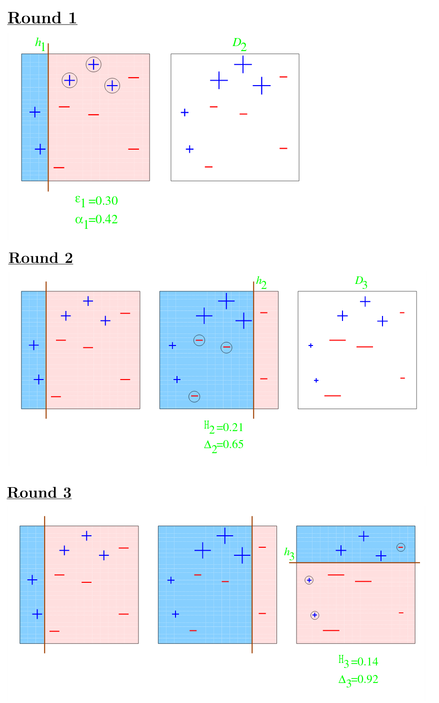
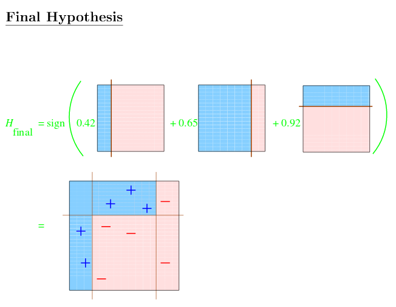

```{r setup, include=TRUE, echo=FALSE}
knitr::opts_chunk$set(echo = TRUE)
knitr::opts_chunk$set(fig.align = 'center', fig.height=3.5, fig.width=5)
```

```{r echo=FALSE, message=FALSE}
library(caret)
library(ggplot2); library(gridExtra)
```

# Decision Trees

A _decision tree_ is a data structure that shows _conjuctive_ (logical `AND`) relationships. You can think of it as a map of binary if-then tests.

A _classification_ tree is a binary structure that outputs the class which contains the input data.

A _regression tree_  outputs a real number.

Decision trees become more powerful when constructed en masse. _Bagging_ is a process that creates many decision trees and outputs the consensus prediction of those trees. The _Random Forest_ is a group of decision trees that . . .

Tree predicting is a type of unsupervised learning. A completed tree has ranked the input variables by how well they predict an outcome. Nodes further down the tree represent the logical conjuction of a variable and all preceding variables.

A high level interpretation is that you use the input variables to split the outcomes into groups based on feature values, then evaluate the homogeneity of outcomes in each group (splitting again if necessary). This type of analysis is easy to interpret and has good performance, but allows only poor estimates of uncertainty and is prone to overfitting. (Results may not be consistent.)

## Decision Tree Algorithm

1. Start with all the features
2. Find the single feature that best separates the outcomes
3. Divide the data into two groups (leaves) on that split (node)
4. Within each leaf, repeat 2-3
5. Continue until groups are sufficiently small or homogenous

## Measures of Homogeneity

How do we know when the groups are sufficiently homogenous, or _pure_? 

A simple way is to count the fraction of occurrences of class $k$ :

* $N$ is the number of examples in leaf $m$
* $x_i$ is 1 training example
* $y_i$ is the outcome of $x_i$
* $k$ is an output class
* $\delta_{y_i k}$ is the Kronecker delta

$$
\mbox{For each leaf } m: ~~ \hat{p}_{mk} = \frac{1}{N_m} \sum_{x_i}{\delta_{y_i k}}
$$

Define also 

* $k(m)$ is the _most common_ class in leaf $m$
* $\hat{p}_{mk(m)}$ is the probability in leaf $m$ that $y_i = k(m)$

Then the _misclassification error_ is 
$$ 
ME = 1 - \hat{p}_{mk(m)} ~~~
\left\{\begin{matrix}
ME = 0 & \rightarrow &\mbox{perfect purity}\\ 
ME = .5 & \rightarrow & \mbox{no purity}
\end{matrix}\right.
$$

$ME = 1$ is perfect impurity, or perfect purity for the class "not $k$". But, since we usually define things in terms of the class $k$, we rarely see $ME = 1$.

Another measure of purity is the __Gini impurity__, which measures the probability that a randomly labeled outcome would be incorrect. It is the product of probabilites $\hat{p}_{mk}$ and $(1-\hat{p}_{mk})$ summed over _all_ classes $K$

$$ GI =
\sum^{K}_{k=1}{ \hat{p}_{mk} (1 - \hat{p}_{mk}) } ~ = ~
1 - \sum^{K}_{k=1}{ \hat{p^2}_{mk} }
$$

$$
\left\{\begin{matrix}
GI = 0 & \rightarrow &\mbox{perfect purity}\\ 
GI = .5 & \rightarrow & \mbox{no purity}
\end{matrix}\right.
$$

The __Deviance/Information Gain__ measures

$$
DG = - \sum^{K}_{k=1}{\hat{p}_{mk} log_e \hat{p}_{mk} } 
$$
$$
IG = - \sum^{K}_{k=1}{\hat{p}_{mk} log_2 \hat{p}_{mk} }
$$

$$
\left\{\begin{matrix}
D/I = 0 & \rightarrow &\mbox{perfect purity}\\ 
D/I = 1 & \rightarrow & \mbox{no purity}
\end{matrix}\right.
$$

---

### Example

Consider the following predictions of a binary (red/blue) tree:
```{r echo=FALSE, fig.height=3.75, fig.width=7}
x <- unlist(lapply(1:4, FUN = rep, 4))
y <- rep(1:4,4)
g1 <- ggplot() + geom_point(aes(x=x, y=y), size=2, color="blue") +  
		 geom_point(aes(x=4, y=4), size=2, color="red") + 
		 ggtitle("Low ME")

g2 <- ggplot() + geom_point(aes(x=x, y=y), size=2, color="blue") + 
		 geom_point(aes(x=x[9:16], y=y[9:16]), size=2, color="red") +
		 ggtitle("High ME")

grid.arrange(g1, g2, ncol=2)
```

| Low ME | High ME   |
|---|---|
| $ME = 1/16 = 0.06$ | $ME = 8/16 = 0.5$ |
| $GI = 1 - [(1/16)^2 + (15/16)^2] = 0.12$ | $GI = 1 - [(8/16)^2 + (8/16)^2] = 0.5$ |
| $IG = - \left[\frac{1}{16} log_2 \left(\frac{1}{16} \right) + \frac{15}{16} log_2 \left(\frac{15}{16} \right)\right] = 0.34$ | $IG = - \left[\frac{8}{16} log_2 \left(\frac{8}{16} \right) + \frac{8}{16}  log_2 \left(\frac{8}{16} \right)\right] = 1$ |

The tree that produces the right-hand figure is no better than a random binary classifier.

### Example: Predicting Flower Species

Can we predict a flower's species from its morphology?
```{r}
data(iris)

# The variable (feature) names
names(iris)

# The output classes are the flower species
table(iris$Species)

# Create training sets
inTrain <- createDataPartition(y=iris$Species, p=0.7, list=FALSE)
training <- iris[inTrain, ]; testing <- iris[-inTrain, ];

dim(training); dim(testing)
```

The first plot, petal width v sepal width, does a pretty good job of separating all the examples by species. `Petal.Width` and `Sepal.Width` are probably good predictors (will be near top of tree).
```{r}
ggplot(data=iris) + aes(x=Petal.Width, y=Sepal.Width, color=Species) + geom_point()
```

Train a decision tree model to predict flower species; use `caret::train(..., method="rpart")`
```{r cache=TRUE}
modFit <- train(form = Species~., method = "rpart", data = training )

# model object is huge and complicated; just view the final model member
print(modFit$finalModel)
```

The first node is `root`. There 105 training examples in this node, the loss is 70, the class of interest is `setosa`, and all examples at the root have equal change of being any species.

The second node splits all examples based on $\mbox{Petal.Length} < 2.45$. None of the examples subject to this test are misclassified, and when the condition is true, the examples have 100% probability of being classed as _setosa_.

--- 
Plot the deicision tree (dendogram) with the base plotting package
```{r fig.height=5, fig.width=7}
plot(modFit$finalModel, uniform=TRUE, main = "Classification Tree")
text(modFit$finalModel, use.n=TRUE, all=TRUE, cex=.8)
```

Make a prettier plot with `r::rattle` (uses Gtk+/ X/ XQuartz)
```{r message=FALSE}
library(RGtk2) 
library(rattle)

fancyRpartPlot(modFit$finalModel)
```

According to these dendrograms, `petal.length` and `petal.width` are the best predictors of species, let's recreate our initial plot, using those features.
```{r fig.height=4, fig.width=8}
g1 <- ggplot(data=iris) + aes(x=Petal.Width, y=Sepal.Width, color=Species) + 
			  geom_point() + ggtitle("Petal Width v Sepal Width")

g2 <- ggplot(data=iris) + aes(x=Petal.Length, y=Petal.Width, color=Species) +
			  geom_point() + ggtitle("Petal Length v Petal Width")

grid.arrange(g1, g2, ncol=2)
```
The plot on the right is a bit more distinct than the left.

Use morphology to predict species of new examples with `caret::predict`
```{r message=FALSE}
predict(object = modFit, newdata = testing)
table(predict(object = modFit, newdata = testing))
```

Classification Trees are nonlinear, meaning they automatically include interactions between variables. This also makes them prone to overfitting. They are also less sensitive to feature scaling.


# Bootstrap Aggregating (Bagging)

Bootstrap Aggregating is a meta-algorithm that improves the stability and accuracy of other algorithms by averaging many small models. Remember that _models_ are created by __algorithms__ operating on _training sets_.  By random sampling from one large data set, we can create many different models (sets of specific parameters -- 1 fit to 1 specific subset).

Basic algorithm

1. Random sample a training set (with replacement)
2. Train a model 
3. Repeat many times
4. Aggregate the model parameters
	+ aggregation methods can be average, majority vote, etc.
	
Bagging preserves bias while reducing variance. It is most useful for nonlinear functions.	

For the following examples, use the `ElemStatLearn::ozone` package.
```{r}
library(ElemStatLearn); data(ozone, package = "ElemStatLearn")

ozone <- ozone[order(ozone$ozone),]

# this data set has 4 features
head(ozone)
```

### Example: Fit a Polynomial Model

Use `stats::loess()` to train a multivariate polynomial (uses local fitting, susceptible to overtraining). Try to predict temperature as a function of ozone.
```{r}
# span is a smoothing parameter
ll <- loess(formula = temperature ~ ozone, data = ozone, span = 0.2)
```

`ll` is another massive object of type `loess` that represents a trained polynomial model. We can use it to make predictions with `stats::predict()`
```{r}
predict(object = ll, newdata = ozone[1:5,] )
```

### Example: Aggregate Many Polynomial Models

The previous example can be statistically robustified by taking many subsamples of `ozone`, training a `loess()` model on each, then taking the statistical mean of all their parameters.
```{r cache=TRUE, warning=FALSE}
# prepare a structure to hold all the models (rows of parameters)
ll <- matrix(NA, nrow=10, ncol=155)

# take 10 random subsets from ozone - then train model on each
for (i in 1:10) {
	ss <- sample(x = 1:nrow(ozone), replace = TRUE)
	
	ozone0 <- ozone[ss,]
	ozone0 <- ozone0[order(ozone0$ozone),]
	
	# train model of temperature as a function of ozone level
	loess0 <- loess(formula = temperature ~ ozone, data = ozone0, span = 0.2)
	
	# use little model to predict temperature based on a dummy vector of ozone levels
	ll[i,] <- predict(object = loess0, newdata = data.frame( ozone=1:155 ) )
}

# plot the 10 models against the data 
plot(ozone$ozone, ozone$temperature, pch=19, cex=.5)
for (i in 1:10) {
	lines(x = 1:155, y = ll[i,], col="grey", lwd=1)	
}
```

Note that the 10 predicted vectors don't agree very well. What happens when we average all the predictions?
```{r}
# plot the 10 models against the data 
plot(ozone$ozone, ozone$temperature, pch=19, cex=.5)
for (i in 1:10) {
	lines(x = 1:155, y = ll[i,], col="grey", lwd=1)	
}

# plot the average of all predictions from the 10 models
avg <- apply(X = ll, MARGIN = 2, FUN = mean)
lines(x = 1:155, y = avg, col="red", lwd=2)
```
The average is less susceptible to outliers and local extrema. (`loess()` preforms local fitting, thus is easily biased by outliers.)

## Bagging in Caret

Caret can automate bagging in 2 ways

1. `caret::train(..., method = {bagEarth, treebag, bagFDA} )`
2. The _bag_ function `caret::bag()` (advanced)

### Example: Aggregate with Caret

```{r cache=TRUE, warning=FALSE}
predictors <- data.frame(ozone = ozone$ozone)
temperature <- ozone$temperature

# assign parameters to bag() with bagControl() fcn
bg <- bagControl(fit = ctreeBag$fit, predict = ctreeBag$pred, aggregate = ctreeBag$aggregate)

# B = num of bootstrap iterations/folds
treebag <- bag(predictors, temperature, B=10, bagControl=bg)
```
Creates a _bag_ class object holding the aggregated parameters???

Plot it
```{r}
plot(x = ozone$ozone, y = temperature, col="lightgrey", pch=19)
points(x = ozone$ozone, y = predict(object = treebag$fits[[1]]$fit, predictors), pch=19, col="red" )
points(x = ozone$ozone, predict(treebag, predictors), pch=19, col="blue")

```

The red dots are the fit from a single conditional regression tree. The blue dots are the fit averaged from 10 regression trees. You can see that the blue points have lower variance and better fit the trend of the actual data.

## Parts of Bagging

To train bagged tree models:
```{r}
# Takes input and output data frames x and y, then uses ctree() to fit y 
# as a function of all columns in x.
ctreeBag$fit
```

To make new predictions with the bagged tree model:
```{r}
# Takes the ctree object and a new input set x.
# Then, calculates the probability matrix and predicted output.
ctreeBag$pred
```

To aggregate many models:
```{r}

# rbinds predictions from many models and takes the median predicted value from each model.
ctreeBag$aggregate
```

Bagging will give smoother model fits than predictions from a single model.

# Random Forests

The Random Forest is a bagging method that only considers a subset of the features for each model.  It has good accuracy, but is slow, difficult to interpret, and tends to overfit. 

A basic algorithm is 

1. Bootstrap Samples
2. At each node, bootstrap features
3. Train multiple trees and vote on the best

A random classification forest should use $\sqrt n$ features, and a random regression forest should use $n/3$ at each split (node). A good minimimum is always at least 5 features.

The `randomForest` package should be installed by the base `stats` package.

Using the _Iris_ data set.
```{r}
data(iris)
names(iris)

table(iris$Species)

inTrain <- createDataPartition(y=iris$Species, p=0.7, list=FALSE)
training <- iris[inTrain, ]; testing <- iris[-inTrain, ]

dim(training); dim(testing)
```

Train a random forest with `caret::train(..., method="rf")`
```{r cache=TRUE, message=FALSE}
library(caret); library(randomForest)

# fits Species as fcn of all features
modFit <- train(form = Species~., method = "rf", data = training, prox=TRUE )
modFit
```


### Example: Extracting Trees

Extract a single tree from the forest with
```{r message=FALSE}
library(randomForest)
getTree(rfobj = modFit$finalModel, k=2)
```

## Mean Class Values (Centers)

The `randomForest::classCenter()` function
```{r}
# outputs a matrix
irisP <- classCenter(training[,c(3,4)], training$Species, modFit$finalMod$prox  )


irisP <- as.data.frame(irisP)
irisP$Species <- rownames(irisP)

# plot points
p <- ggplot(data=training) + aes(x=Petal.Width, y=Petal.Length, color=Species) +geom_point()

# plot class centers
p <- p + geom_point(data=irisP, aes(x=Petal.Width, y=Petal.Length, color=Species), color="black", size=5, shape=4)
print(p)
```

### Example: Making Predictions

```{r cache=TRUE}
pred <- predict(modFit, testing)
testing$predRight <- (pred == testing$Species)

table(pred, testing$Species)

p <- ggplot(data=testing) + aes(x=Petal.Width, y=Petal.Length, color=predRight) + geom_point()
p <- p + ggtitle("newdata Predictions")

print(p)
```

Random forests are some of the top performing algorithms because theyy are invariant to feature scaling (like binary trees), but have lower variance and do not overfit as badly as binary trees.


# Boosting

Boosting is one of the most accurate general algorithms in use. The boosting algorithm

1. Takes many weak predictors 
2. Weights and adds them

More formally, 

1. Take all possible trees/classifiers/models/etc. $h_1 ... h_k$
2. Create a training function that combines them:
$$
F_T(x) = sgn \left( \sum^T_{t=1}{ \alpha_t h_t(X) } \right)
$$

* $\alpha_t$ is a weight
* $h_t(X)$ is a classification function
* $sgn$ is the _signum_ [function](https://en.wikipedia.org/wiki/Sign_function)

The optimization goal is to minimize training set error. On each training iteration $t$:

1. Add a new $h_k$ 
2. Calculate cost
3. Select a weight that minimizes cost
4. Repeat 1-3

The most popular boosting algorithm is [Adaboost](https://en.wikipedia.org/wiki/AdaBoost), which basically does what I just described. There is a nice [tutorial](http://webee.technion.ac.il/people/rmeir/BoostingTutorial.pdf) by Ron Meir.
And a [better tutorial](http://www.cc.gatech.edu/~thad/6601-gradAI-fall2013/boosting.pdf) from Georgia Tech.

Useful R boosting libraries are

* `gbm` - boosting with trees
* `mboost` - model based boosting
* `ada` - statistical boosting based on additive logistic regression
* `gamBoost` - for boosting generalized additive models

Most of these libraries can be accessed through `caret::method = `

### Adaboost Example

Each iterated hypothesis draws a straight line. All misclassified points 





### Example

Use `gbm` (tree boosting) to predict wages from demographics
```{r}
library(ISLR); library(ggplot2); library(caret)
data(Wage) 
  
Wage <- subset(Wage, select=-c(logwage))
inTrain <- createDataPartition(y=Wage$wage, p=0.7, list=FALSE)
training <- Wage[inTrain, ]; testing <- Wage[-inTrain, ]
```

```{r cache=TRUE, message=FALSE, warning=FALSE}  
modFit <- train(form = wage~., method = "gbm", data = training, verbose = FALSE)
print(modFit)

```

Plot the results:
```{r message=FALSE}
predictions <- predict(object = modFit, newdata = testing)
ggplot(data=testing) + aes(x=predictions, y=wage) + geom_point()
```


# Model Based Preidction

Model based prediction is the underlying method in __linear discriminant analysis__ and __quadratic discriminant analysis__ 
assumes that the data follows some probabilistic model, then uses Bayes' theorem to identify the best classifiers. This process performs well, but relies on the data actually following your hypothesis.

More formally, we want to build a parametric model for the conditional distribution 
$P(Y=k | X=x)$.

Recall from Bayes' theorem that

$$
P(Y=k | X=x) = \frac{P(X=x|Y=k) \times P(Y=k)}{\sum^K_{l=1}{P(X=x|Y=l) \times P(Y=l)}}
$$

Defining the _Bayesian prior_ $\left( P(Y=k) = \pi_k \right)$ as the probability that Y belongs to class $k$  gives

$$
P(Y=k | X=x) = \frac{f_k(x)\pi_k}{\sum^K_{l=1}{f_l(x)\pi_l}}
$$

Commonly, a __Gaussian Function__ is chosen for $f_k(x)$, such that

$$
f_k(x) =  \frac{1}{\sigma_k \sqrt{2\pi}} exp{\left() \frac{(x-\mu_k)^2}{\sigma^2_k} \right)}  
$$

Where the distribution parameters $(\mu_k , \sigma_k)$ are estimated from the data.

$Y_i$ will be predicted to be the class $k$ with the highest value of $P(Y=k | X=x)$

---

Linear discriminant analysis assumes that $f_k(x)$ is a multivariate Gaussian with the same covariances in $x'$ and  $y'$. Quadratic discriminant analysis assumes a multivariate Gaussian with different covariances in $x'$ and $y'$. Other types of model based prediction make more complicated assumptions about the covariance of $f_k$, while the Naive Bayes method assumes independence between features.

## Linear Discriminant Analysis

Linear Discriminant analysis draws straight lines through the feature space, attempting to separate the data. (Compared to _quadratic_ discriminant analysis, which draws curves).

Consider the ratio of probabilities that $Y$ belongs to some class, applying Bayes' theorem gives

$$
log \frac{P(Y=k|X=x)}{P(Y=j|X=x)} = log \frac{f_k(x)}{f_j(x)} + log \frac{\pi_k}{\pi_j}
$$

$$
= log \frac{\pi_k}{\pi_j} - {1 \over 2}(\mu_k+\mu_j)^T \sigma^{-1}(\mu_k+\mu_j) + x^T  \sigma^{-1}(\mu_k-\mu_j)
$$

Where $\sigma$ is the covariance matrix.

The decision boundaries are straight lines spoking out from a central point, with a gaussian distribution in each region

--- 
Defining the __discriminant function__ as

$$
\delta_k(x) = x^T \sigma^{-1}\mu_k - {1 \over 2}\mu_k\sigma^{-1}\mu_k + log \mu_k
$$

then predictions becomre

$$
\hat Y (x) = \mbox{argmax}_k \delta_k(x)
$$

In this case, the parameters $\mu_k$ and $\Sigma$ (?) are obtained via [maximum likelihood estimation](https://en.wikipedia.org/wiki/Maximum_likelihood_estimation).


## Naive Bayes Classifiers

Naive Bayes Classifiers do the same thing even more simply. For a group of features $(X_1 ... X_n$, applying Bayes' theorem simplifies to

$$
P(Y=k ~|~ X_1 ...X_N) \propto \pi_k P(X_1 ...X_N~|~Y=k)
$$

Which expands to 

$$
P(Y=k ~|~ X_1 ...X_N) \approx \prod^N_{n=1}{P(X_n~|~Y=k)}
$$

### Example: Model Based Classifier

In `caret::train()`, use

* `method="lda"` for linear discriminant classifiers
* `method="nb"` for naive bayes classifiers

Using the `iris` data set
```{r}
library(ggplot2)

data(iris)
names(iris)

table(iris$Species)

inTrain <- createDataPartition(y = iris$Species, p = 0.7, list = FALSE)
training <- iris[inTrain,]; testing <- iris[-inTrain,]

dim(training); dim(testing)
```

Making predictions with two different methods (lda and naive bayes)
```{r cache=TRUE, message=FALSE, warning=FALSE}
modlda <- train(form = Species~., method="lda", data=training)
modnb <- train(form = Species~., method="nb", data=training)

plda <- predict(object = modlda, newdata = testing)
pnb <- predict(object = modnb, newdata = testing)

table(plda, pnb)
```

Compare predictions
```{r}
equalPredictions <- (plda == pnb)
table(equalPredictions)

ggplot(data=testing) + aes(x=Petal.Width , y=Sepal.Width, color=equalPredictions) + geom_point()
```
The two algorithms classify all points the same, exept for two.
