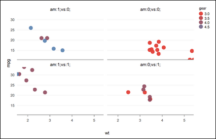
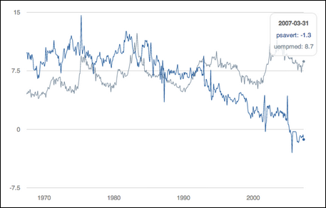
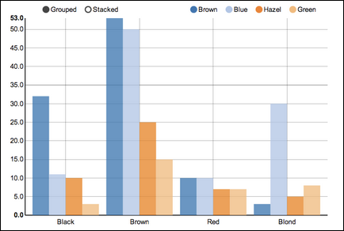
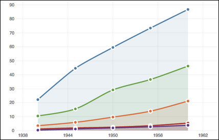
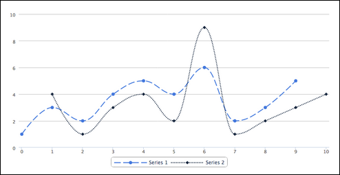
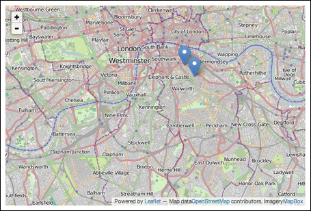
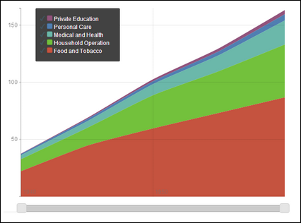

```{r echo=FALSE, results='hide', warning=FALSE}

if (!"rCharts" %in% installed.packages()[,'Package']) { install.packages("rCharts") }
if (!"rCharts" %in% library()['Package']) { library("rCharts") }
```

# rCharts Basics

rCharts is a package that uses javascript to create interactive visualizations for R. It (kind of) emulates the javascript D3 library.

For more info, see 

* [http://ramnathv.github.io/rCharts/]("http://ramnathv.github.io/rCharts/")
* [https://github.com/ramnathv/rCharts]("https://github.com/ramnathv/rCharts")

Install rCharts with the following:
```{r eval=FALSE}
require(devtools)
install_github(repo = 'rCharts', username = 'ramnathv')
```

Much of the interactivity is baked in by default via the various d3js libraries called by rCharts.

<font color="red">*Note: rChart plots render differently in knitr vs console. See</font>  [StackOverflow.]("http://stackoverflow.com/questions/17168464/2-knitr-r-markdown-rstudio-issues-highcharts-and-morris-js")

For knitr:  

* plot with `myPlot$print(title = 'title', include_assets=TRUE)`
* r chunk options must include `results='asis'`
* print the raw html with option `results='markup'`

---

For console:

* plot by calling the variable: `myPlot;`
* or by calling the plotting function: `rPlot(...);`

---

For RPubs:

* Use knitr with listed options
* use `myPlot$print(title = 'title', include_assets=TRUE, cdn=TRUE)`
	+ `cdn=TRUE` instructs document to serve JS+CSS from RPubs rather than your local directory asset library

---

### Example 1: MorrisJS Plotting Library

In this example, `reshape2::transform()` is loaded automatically by `rCharts`.  
```{r, results='asis'}
require(rCharts)

data(economics, package = "ggplot2")
econ <- transform(economics, date = as.character(date))
m1 <- mPlot(x = "date", y = c("psavert", "uempmed"), type = "Line", data = econ)
m1$set(pointSize = 0, lineWidth = 1)
m1$print("chart2", include_assets=TRUE)

```

Per [http://ramnathv.github.io/rCharts/]("http://ramnathv.github.io/rCharts/"), rCharts has the following default libraries, invoked by the corresponding rChart functions.  
*Note: It appears that only Polychart and MorrisJS work out-of-the-box with rChart. The remainder need some additional libraries or configuration.

* Polychart:	`rPlot()` 
	+ _Grammer of Graphics_ syntax style, similar to __ggPlot2__
	+ [https://github.com/Polychart/polychart2]("https://github.com/Polychart/polychart2")
	+ 

```{r, results='asis'}
require(rCharts)

r1 <- rPlot(mpg ~ wt | am + vs, data = mtcars, type = "point", color = "gear")
r1$print("Polychart", include_assets=TRUE)
```
	

---

* MorrisJS:	`mPlot()`
	+ time series graphs: line, bar, area, donut style
	+ [http://morrisjs.github.io/morris.js/]("http://morrisjs.github.io/morris.js/")
	+ [https://github.com/oesmith/morris.js]("https://github.com/oesmith/morris.js")
	+ 
	
```{r, results='asis'}
require(rCharts)

data(economics, package = "ggplot2")
econ <- transform(economics, date = as.character(date))
m2 <- mPlot(x = "date", y = c("psavert", "uempmed"), type = "Line", data = econ)
m2$set(pointSize = 0, lineWidth = 1)
m2$print("Morris", include_assets=TRUE)
```	

---
	
* NVD3:		`nPlot()`
	+ charts that require little customization, based reusable chart components
	+ [http://nvd3.org/]("http://nvd3.org/")
	+ [https://github.com/novus/nvd3]("https://github.com/novus/nvd3")
	+ [http://bost.ocks.org/mike/chart/]("http://bost.ocks.org/mike/chart/")
	+ 
	
	
```{r results='asis'}
require(rCharts)

hair_eye_male <- subset(as.data.frame(HairEyeColor), Sex == "Male")
n1 <- nPlot(Freq ~ Hair, group = "Eye", data = hair_eye_male, type = "multiBarChart")
n1$print("NVD3", include_assets=TRUE, cdn=FALSE)
```

---

* xCharts:	`xPlot()`
	+ includes SVG for infinitely scalable charts
	+ [http://tenxer.github.io/xcharts/]("http://tenxer.github.io/xcharts/")
	+ [https://github.com/tenXer/xcharts/]("https://github.com/tenXer/xcharts/")
	+ 

```{r results='asis'}
require(rCharts)
require(reshape2)

uspexp <- melt(USPersonalExpenditure)
names(uspexp)[1:2] = c("category", "year")
x1 <- xPlot(value ~ year, group = "category", data = uspexp, type = "line-dotted")
x1$print("xCharts", include_assets=TRUE)
```

---
	
* HighCharts:	`hPlot()`
	+ claims to be simples & most flexible, free for non-commercial
	+ related to js libraries _HighStock_ (time series), _HighMaps_ (maps), HighChartsCloud (cloud deployed charts) 
	+ [http://www.highcharts.com/]("http://www.highcharts.com/")
	+ Features: [http://www.highcharts.com/products/highcharts/#open]("http://www.highcharts.com/products/highcharts/#open")
	+ 

```{r results='asis', warning=FALSE}
require(rCharts)

h1 <- Highcharts$new()
h1$chart(type = "spline")
h1$series(data = c(1, 3, 2, 4, 5, 4, 6, 2, 3, 5, NA), dashStyle = "longdash")
h1$series(data = c(NA, 4, 1, 3, 4, 2, 9, 1, 2, 3, 4), dashStyle = "shortdot")
h1$legend(symbolWidth = 80)

h1$print("HighCharts", include_assets=TRUE)
```

---
	
* Leaflet:	`Leaflet$new()`
	+ interactive maps
	+ [http://leafletjs.com/]("http://leafletjs.com/")
	+ Features: [http://leafletjs.com/#features]("http://leafletjs.com/#features")
	+ 36 Plugins: [http://leafletjs.com/plugins.html]("http://leafletjs.com/plugins.html")
	+ 


```{r results='asis'}
require(rCharts)

map3 <- Leaflet$new()
map3$setView(c(51.505, -0.09), zoom = 13)
map3$marker(c(51.5, -0.09), bindPopup = "<p> Hi. I am a popup </p>")
map3$marker(c(51.495, -0.083), bindPopup = "<p> Hi. I am another popup </p>")
map3$print("Leaflet", include_assets=TRUE)
```
---
	
* Rickshaw:	`Rickshaw$new()`
	+ time series charts
	+ [https://github.com/shutterstock/rickshaw]("https://github.com/shutterstock/rickshaw")
	+ 

```{r eval=FALSE, results='asis'}
require(rCharts)

usp = reshape2::melt(USPersonalExpenditure)
# get the decades into a date Rickshaw likes
usp$Var2 <- as.numeric(as.POSIXct(paste0(usp$Var2, "-01-01")))
p4 <- Rickshaw$new()
p4$layer(value ~ Var2, group = "Var1", data = usp, type = "area", width = 560)
# add a helpful slider this easily; other features TRUE as a default
p4$set(slider = TRUE)
p4$print("Rickshaw", include_assets=TRUE, cdn=TRUE)

```

# Publishing rCharts

Publishing in any format is done in 2 steps

1. Save the rCharts plot to a variable
	+ `r1 <- rPlot(...)`
2. Do a framework-specific publishing step
	+ console, browser, knitr, RPubs, Gist, Slidify, Shiny
	
In general

* `r1$html()`
	+ prints the html + js + css for the plot
* `r1$save("filename.html", cdn=FALSE)`	
	+ saves plot to html file, can be loaded into browser
	+ when hosting remotely (~RPubs), `cdn=TRUE` serves assets from the remote source
* `r1$print(title="one_word_title", include_assets={TRUE,FALSE})`
	+ for knitr, `include_assets=TRUE`
* `r1$publish(title='title', host={'gist', 'rpubs', etc.})
	+ publishes to externally hosted site

All static publishing is done with an `rCharts::_Plot::publish()` function.

Dynamic charts are embedded into Shiny by calling  
`rCharts::renderChart(expr = <all code>)` in `server.r`  
and  
`rCharts::showOutput(outputId='<name of chart var: server::output$_____>', lib='js_plotting_lib')` in the `mainPanel()` function of `ui.r`.

```{r eval=FALSE}

r1 <- rPlot(...)
r1$publish(title = 'Title', host = {'rpubs', 'gist', etc.})
```

## Console

Simply call the plot object, ex `r1;`

## Knitr

Print the object with `r1$print(title='unique_title', include_assets=TRUE)` using knitr r chunk option `{r results='asis}`.  
Each chart title in a document must be unique, or knitr will print the charts in the wrong place.

```{r eval=FALSE}
require(rCharts)

names(iris) = gsub("\\.", "", names(iris))

r1 <- rPlot(SepalLength ~ SepalWidth | Species, data = iris, color = 'Species', type = 'point')

r1$print('Unique_Title', include_assets=TRUE)
```


## RPubs

```{r eval=FALSE}
require(rCharts)

names(iris) = gsub("\\.", "", names(iris))

r1 <- rPlot(SepalLength ~ SepalWidth | Species, data = iris, color = 'Species', type = 'point')

r1$publish('Scatterplot', host = 'rpubs')
```


## Gist

```{r eval=FALSE}
require(rCharts)

names(iris) = gsub("\\.", "", names(iris))
r1 <- rPlot(SepalLength ~ SepalWidth | Species, data = iris, color = 'Species', type = 'point')

r1$publish('Scatterplot', host = 'gist')
```

## Slidify Interactive

Embedding in Slidify requires an additional line in the YAML header:
`yaml ext_widgets : {rCharts: ["libraries/nvd3", "libraries/morris", etc]}`

1. Save the plot to file 
	+ `obj$save("file.html")`
2. Embed into slidify
	+ `cat('<iframe src="path/to/file.html" width=100%, height=600></iframe>')`
	
```{r eval=FALSE}
require(rCharts)

names(iris) = gsub("\\.", "", names(iris))
r1 <- rPlot(SepalLength ~ SepalWidth | Species, data = iris, color = 'Species', type = 'point')

cat('<iframe src="r1.html" width=100%, height=600></iframe>')
```	

## Shiny

* must `return(plot_obj)` the plot object inside `renderChart()`
```{r eval=FALSE}
## server.r
require(rCharts)
shinyServer(function(input, output) {
	
  # rCharts::renderChart() takes all the calculation & plotting code
  # and stores the result in the output$myChart; call showOutput('myChart') in ui.r
  output$myChart <- renderChart({
  	
    names(iris) = gsub("\\.", "", names(iris))
    p1 <- rPlot(input$x, input$y, data = iris, color = "Species", 
      facet = "Species", type = 'point')
    p1$addParams(dom = 'myChart')
    return(p1)
  })
})

## ui.R
require(rCharts)
shinyUI(pageWithSidebar(
  headerPanel("rCharts: Interactive Charts from R using polychart.js"),

  sidebarPanel(
    selectInput(inputId = "x",
     label = "Choose X",
     choices = c('SepalLength', 'SepalWidth', 'PetalLength', 'PetalWidth'),
     selected = "SepalLength"),
    selectInput(inputId = "y",
      label = "Choose Y",
      choices = c('SepalLength', 'SepalWidth', 'PetalLength', 'PetalWidth'),
      selected = "SepalWidth")
  ),
  mainPanel(
  	
    # call by the name of server::output#myChart;
    # 'polycharts' is the JS lib that does the plotting	
    showOutput("myChart", "polycharts")
  )
))
```

# Examples

## Facetted Scatterplot

With the Polycharts library, use `rPlot(..., type = 'point')`
```{r results='asis'}
require(rCharts)

names(iris) = gsub("\\.", "", names(iris))
r1 <- rPlot(SepalLength ~ SepalWidth | Species, data = iris, color = 'Species', type = 'point')

r1$print("Facetted_Scatterplot", include_assets=TRUE)
```

## Facetted Barplot

With the Polycharts library, use `rPlot(..., type = 'bar')`
```{r, results='asis'}
require(rCharts)

hair_eye = as.data.frame(HairEyeColor)
r2 <-rPlot(Freq ~ Hair | Eye, data = hair_eye, color = 'Eye', type = 'bar')

r2$print("Facetted_Barplot", include_assets=TRUE)
```

## Time Series Line Chart
With MorrisJS, `type = 'Line'`. Notice also that there are 2 series in this plot via `y = c('psavert', 'uempmed')`; unique to Morris??

```{r, results='asis'}
require(rCharts)

data(economics, package = "ggplot2")
econ <- transform(economics, date = as.character(date))
m1 <- mPlot(x = "date", y = c("psavert", "uempmed"), type = "Line", data = econ)
m1$set(pointSize = 0, lineWidth = 1)
m1$print("Time_Series", include_assets=TRUE)
```


